export const Highlight = ({children, color}) => (
  
    {children}
  
);

# Carta de Versão - 1.10.25

## Módulo Fiscal

###  Consulta Rentenções 

**Funcionalidade:** Permitirá que o usuário visualize as informações consolidadas. 

O usuário deverá acessar o módulo fiscal: 

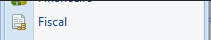

Acessar a tela de Consultas Retenções 

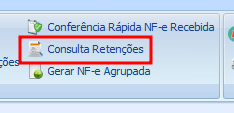

Nesta tela foi incluso a flag para visualização consolidada 

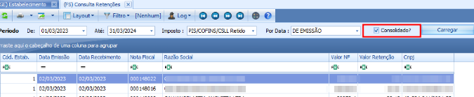
 
### Parâmetros 

**Funcionalidade:** Permitirá que informe o valor custo quando houver uma transferência. 

O usuário deverá acessar o módulo fiscal: 

Acessar a tela de parâmetros, editar um cadastro e visualizar na aba <Highlight>Geral</Highlight>: 

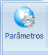

Quando a nova flag <Highlight>Usa Custo Fixo no Valor da Nota de Transferência</Highlight> estiver marcada, será possível informar o valor do custo fixo, porém, se não estiver, não será possível informar o valor e quando o registro for salvo não se aplicará nas notas. Contudo, se a opção estiver marcada, ela definirá o valor dos produtos informados no momento da solicitação das notas fiscais (válido também para solicitação de notas a partir de pedidos de venda e ordens de serviços). 

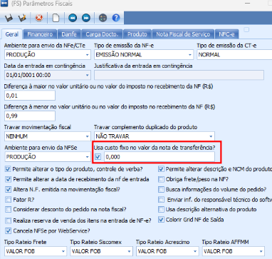

### Entrada de Nota Fiscal 

**Funcionalidade:** Sistema validará a chave de acesso informada ao realizar uma entrada manual da nota fiscal. 

O usuário deverá acessar o <Highlight>Módulo Fiscal | Entrada de Nota Fiscal</Highlight> 

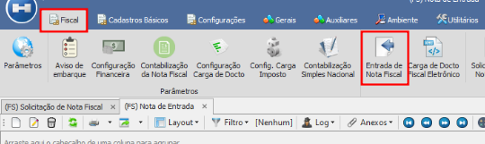

Deverá clicar em novo e informar a chave de acesso, o sistema validará a chave de acesso e caso seja diferente do CNPJ da empresa, o sistema não permitirá gravar. 

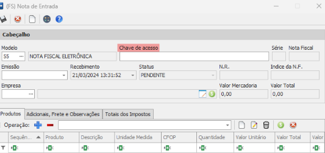

## Módulo Vendas 

### Pedido de Vendas 

**Funcionalidade:** O usuário poderá visualizar na tela de pedido de venda se o cliente está inadimplente. 

Acessar o módulo de <Highlight>Vendas | Pedidos | Pedidos de Vendas</Highlight> 

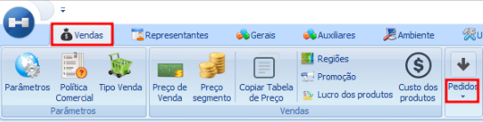
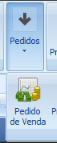

Para considerar o cliente como inadimplente o sistema irá checar: 

- Se existem títulos em aberto; 

- Se na tabela de informações financeiras da empresa ela consta como inadimplente; 

- Se existe ou não uma liberação para aquele pedido; 

- Se o pedido está com status "pendente" ou "aprovado"; 

Caso o pedido tenha esses parâmetros ele é exibido em vermelho (toda a linha) e marcado a flag "Inadimplente". 

### Política Comercial 

**Funcionalidade:** Permitirá colocar um limite de venda por representante. 

#### Aba Gerais | Empresas 

Para utilizar a nova funcionalidade é necessário um limite de crédito para o representante, acessar <Highlight>Empresas | Aba Financeiro</Highlight> 

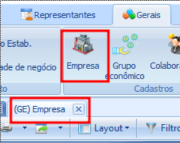

Acessar a aba financeiro, clicar em novo e informar o valor do <Highlight>Limite de Crédito</Highlight>. 

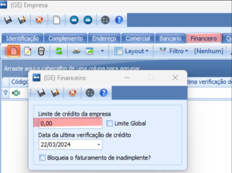

Obs.: Este limite será levado em consideração ao determinar o valor na <Highlight>Política Comercial</Highlight>. 

#### Limite de Crédito por Representante 

Para utilizar a nova função o usuário deverá acessar o <Highlight>Módulo Vendas | Política Comercial | Novo</Highlight>.

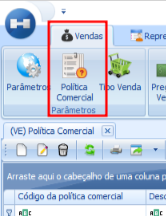
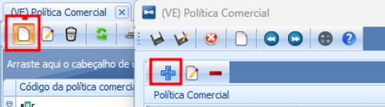

Selecionar a opção <Highlight>Limite de Crédito de Representação</Highlight>: 

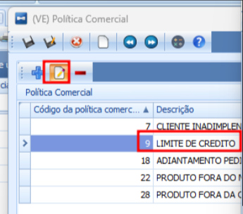

Informar o valor e qual ação deverá ser tomada: 

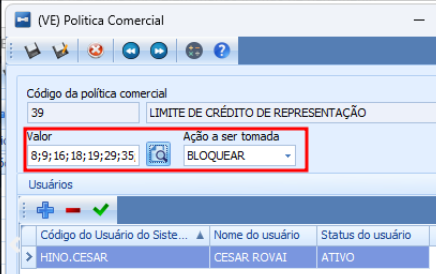

A política irá avaliar se o saldo em aberto a receber dos pedidos/notas do representante ultrapassa o limite de crédito do representante. Caso passar irá realizar a ação configurada na política. 

Exemplo da mensagem exibida quando o pedido cair na política: 

"LIMITE DE CRÉDITO DE REPRESENTAÇÃO ULTRAPASSADO. VALOR DISPONÍVEL: R$ 2,00 - VALOR UTILIZADO: R$ 0,00 - VALOR FUTURO: R$ 682,74" 

Onde o valor disponível é o limite de crédito do representante, o valor utilizado é quanto já está em sua carteira e o valor futuro é o valor utilizado + o valor do pedido que está sendo aprovado. 

#### Portal CRM | Vendas 

Esta função tem integração com o portal, portanto, ao ficar em análise o pedido, agora poderá ser consultado o motivo na tela de vendas do portal CRM. Para isto, basta editar o pedido e descer até a área "outros dados": 

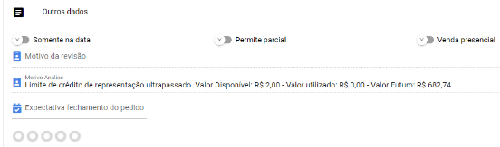

### Divergências EDI 

Realizada melhoria no processo de divergências. 

Acessar o <Highlight>Módulo Vendas | Divergências</Highlight>. 

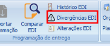
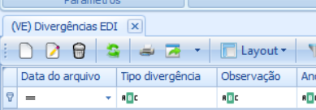

O usuário possa excluir os itens que NÃO estão divergentes e ainda sim mantendo o 'cabeçalho' do EDI. 

Ao clicar em excluir, o sistema vai perguntar se o usuário deseja manter apenas os itens divergentes, em caso de negativa o sistema vai fazer sua rotina padrão, ou seja, vai excluir o arquivo todo. 

## Módulo Gerais 

### Estabelecimento | Gerar Cálculo Difal 

**Funcionalidade:** Permitir considerar o DIFAL para o sublimite. 

Acessar a tela <Highlight>Gerais | Estabelecimentos | Aba Atividade e Regime Tributário</Highlight>

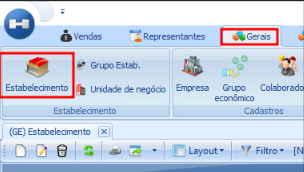

Ao acessar a tela de atividade o usuário poderá marcar a flag <Highlight>Majora ICMS/ISS</Highlight>, com a flag habilitada o sistema   

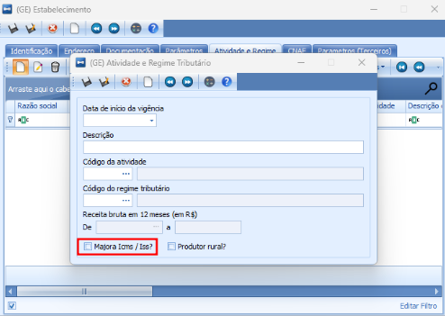

Foram ajustadas as rotinas que realizam o cálculo dos impostos para que o DIFAL seja considerado quando o simples nacional estiver no sublimite.  

### Estabelecimento | Produtor Rural 

**Funcionalidade:** Identificar quais estabelecimento são produtores rurais. 

Acessar a tela <Highlight>Gerais | Estabelecimentos | Aba Atividade e Regime Tributário</Highlight>.

Criado uma flag <Highlight>Produtor Rural</Highlight> para identificar o estabelecimento: 

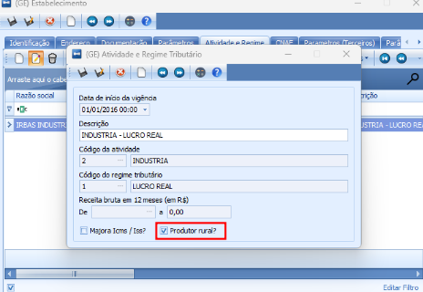

## Módulo Produção 

### Agrupamento O.P. 

Realizado a adição das colunas no GRID. 

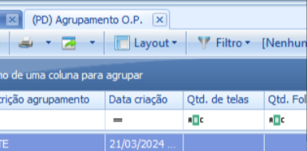

Na tela de agrupamento O.P. foram adicionados os campos de "Pedidos", "Data de início de produção" e "Sequência para produção do dia": 

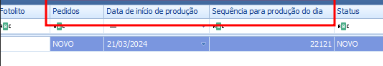 

Os campos citados também foram adaptados no relatório de agrupamento de O.P: 

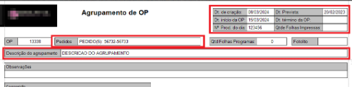

## Módulo Engenharia 

### Estruturas

#### Alterar Estruturas em Massa 

**Funcionalidade:** Realizado melhoria na tela de estrutura para facilitar as alterações. 

Para visualizar as alterações acessar o módulo de <Highlight>Engenharia | Estruturas | Anexos | Alteração de Componentes</Highlight>.

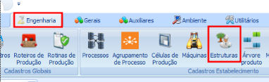
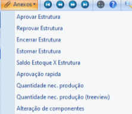

Foi criado um tipo de operação para facilitar o processo de alteração: 

Cada tipo de operação terá comportamentos diferentes: 

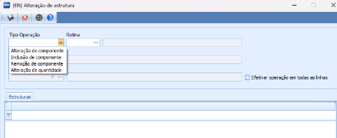

Alteração de componente: Onde o usuário vai informar a rotina e o componente de origem, ao informar essas duas informações o sistema irá carregar o grid com as estruturas vigentes que tem como componente o produto informado. Ao carregar o grid vai existir uma coluna 'FLAG' que irá permitir que o usuário selecione a linha que vai ser feita a operação, também tem uma coluna chamada quantidade para que o usuário informe a quantidade do novo componente. 

Inclusão de componentes: Esta operação vai funcionar parecida com explicada acima, porém o sistema não irá habilitar a seleção do componente de destino, será necessário apenas informar o componente de origem. Após informar o componente que vai ser incluído e a rotina, o sistema vai carregar as estruturas vigentes no grid que tem a rotina selecionada informada para que o usuário possa selecionar em quais estruturas ele quer que seja incluído o componente informado; 

Remoção de componente: Nesta operação o sistema vai se comportar como as outras operações, o usuário informa a rotina e o componente, com isso o sistema carrega no grid as estruturas que contém o componente informado, ao selecionar as linhas que quer que seja excluído o componente o sistema irá executar o procedimento. 

Alteração de quantidade: A alteração de quantidade é simples como a remoção de componentes, o usuário informa a rotina e o componente de origem, com isso o sistema carrega as estruturas que tem o componente informado, o usuário digita a nova quantidade do componente e seleciona as estruturas que ele quer que seja efetivada a operação. 

Efetivar em todas as linhas: 

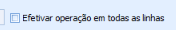 

Caso o usuário tenha marcado a opção de 'Efetivar operação em todas as linhas' não será necessário checar as linhas uma por uma, pois com isso o sistema irá pegar todas as linhas que estão no grid e efetivar a operação desejada nela. 

Observações: Para todas as operações realizadas o sistema cria uma cópia das estruturas e foram selecionadas e depois as encerram. 

## Módulo Logística 

### Lista de Separação 

**Funcionalidade:** Melhoria no relatório de impressão.

## Módulo Integração 

### Configuração de Interface 

**Funcionalidade:** Permitirá integrar os pedidos de vendas e notas fiscais. 

Realizada melhoria no processo de integração. 

## Módulo Financeiro 

### Contas a Receber | Troca de Carteira

**Funcionalidade:** Realizado melhoria no desempenho da tela de troca de carteira. 

Foram realizadas melhorias na otimização das telas de visualização da troca de carteira e no formulário de cadastro dela. Essas melhorias foram implementadas visando aprimorar a velocidade com a qual os registros são salvos, assim como agilizar os processos de aprovação e estorno de trocas de carteira. Tais ajustes terão um impacto substancial na experiência do cliente ao realizar trocas, resultando em uma significativa otimização da usabilidade. 

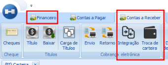

___
 
:::tip 
Para dúvidas e solicitações entrar em contatos através dos canais de suporte: 

**Telefone:** (19) 3090-1393 

**Canal de Chamados:** https://hinosistemas.acelerato.com/home. 
:::
 
 {/* truncate */}