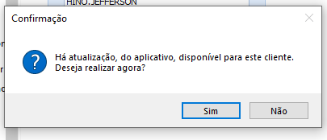

# Realizando o acesso

:::info
**Modulo**: Documentos Gerais

**Objetivo**: Acessar o sistema através de usuário e senha.
:::

:::danger
**Requisitos**

1 - O utilizador deve estar cadastrado e em posse de seu nome de usuário e senha.
:::

:::tip
Quer aprender como cadastrar um usuário? [**Clique Aqui!**](../hino-erp/ambiente/criacao-de-usuarios.md)
:::

## Como acessar o sistema

**Passo 1: Localize o ícone de acesso ao Hino**

- Geralmente o ícone de acesso vai estar na área de trabalho ou fixado na barra de tarefas.

**Passo 2: Execute o programa**

- Ao localizar o ícone de acesso faça: De dois clique no ícone que está na área de trabalho ou um clique no ícone na barra de tarefas. Em ambos os casos o programa irá executar.
- Na tela de login temos os campos para inserir o usuário, a senha, a conexão da empresa e a informação da versão do aplicativo no momento.

**Passo 3: Realize o acesso**

- Insira seu usuário, senha e clique em entrar. Por padrão o usuário vai estar sempre em letras maiúsculas e senha sempre será criptografada.

- Ao realizar o acesso se houver uma atualização disponível para o aplicativo o sistema irá exibir um aviso. Em casos de atualização certifique-se de ter fechado todas as aplicações do HINO.

Do contrário a entrada será bem sucedida.

:::tip
Quer aprender como tratar as atualizações? [**Clique Aqui!**](./atualizacao-de-tags.md)
:::