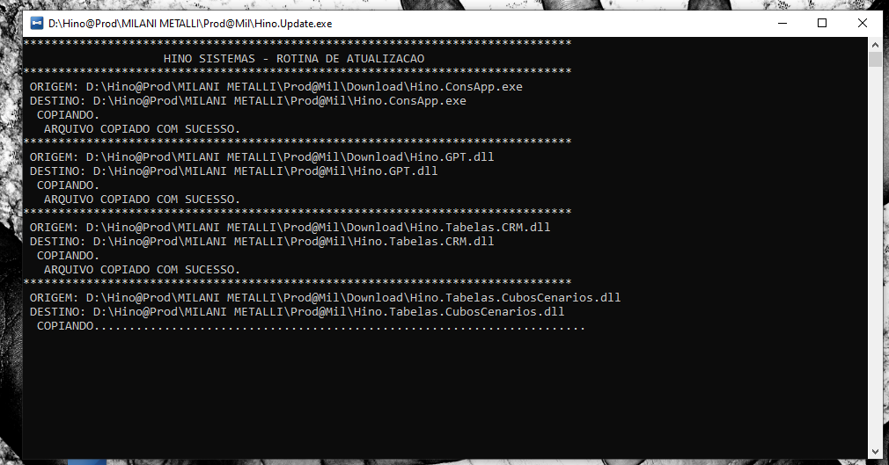

import ReactPlayer from 'react-player'

# Procedimento para atualizações

:::info
**Modulo**: Documentacao Geral

**Objetivo**: Atualizar o software.
:::

:::danger
**Requisitos**

1 - No momento da atualização o software na máquina local que irá atualizar não pode estar em execução.
:::

---

As atualizações automáticas são implementadas sempre que uma nova versão está disponível para o sistema. Essas atualizações visam aprimorar a performance, corrigir falhas, introduzir novas funcionalidades e, até mesmo, incorporar personalizações sob medida. Ao manter o software atualizado, a empresa pode garantir não apenas a estabilidade do sistema, mas também usufruir das mais recentes inovações e aprimoramentos desenvolvidos pela equipe responsável pelo software.

## Procedimento em caso de atualização

**Passo 1: Confirmando a atualização**

- Se ao realizar o acesso ao sistema a janela de atualização aparecer. Clique em ‘Sim’

- Uma nova janela vai surgir informando que o console de atualização será iniciado. Clique em ‘OK’

**Passo 2: Console de atualização**

- O console de atualização será iniciado e nesse momento é necessário aguardar.

**Atenção** : Neste ponto a  atualização só será executada se não houver outras janelas do sistema em execução, se houver o carregamento vai se tornar interminável. 

Se isso estiver acontecendo, verifique se existem outras janelas do aplicativo em execução e as feche.

<ReactPlayer controls url='/videos/documentos-gerais/atualizao_no_terminal.mp4'/>

**Passo 3: Fechando o console**

Após isso a atualização será bem sucedida. Feche o console ao apertar qualquer tecla.

**Passo 4: Realize o acesso**

- A janela de acesso será iniciada, insira suas credenciais e clique em ‘Entrar’.

:::tip
Não sabe como realizar o acesso? [**Clique Aqui!**](https://www.notion.so/Realizando-o-acesso-2cde17c205824b61ac57fbf636243919?pvs=21)
:::