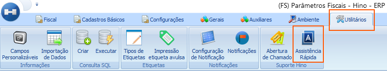
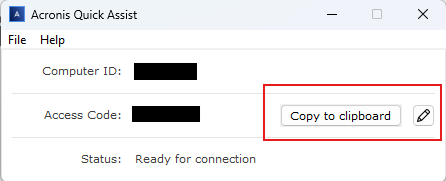

# Suporte via Acronis

:::info
**Modulo**: Documentos Gerais

**Objetivo**: Explicar a utilização do Acronis para a prestação de suporte remoto.
:::

---

Faça login no sistema HINO e acesse o módulo utilitários depois clique em assistência rápida

Após clicar o sistema irá executar um programa chamado Acronis Quick Assist

Agora basta informar o Computer ID e o Acess Code ao nosso atendente e ele conseguirá realizar o acesso remoto em sua máquina para poder auxiliar no que for preciso.

---