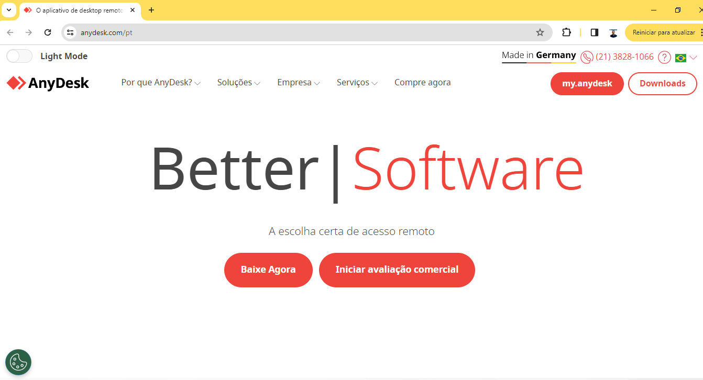
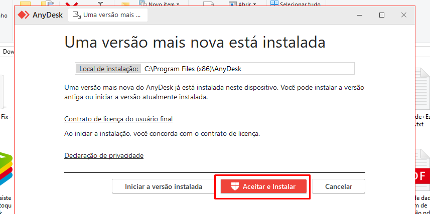
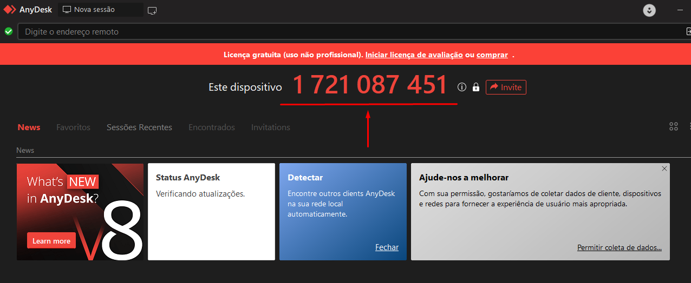
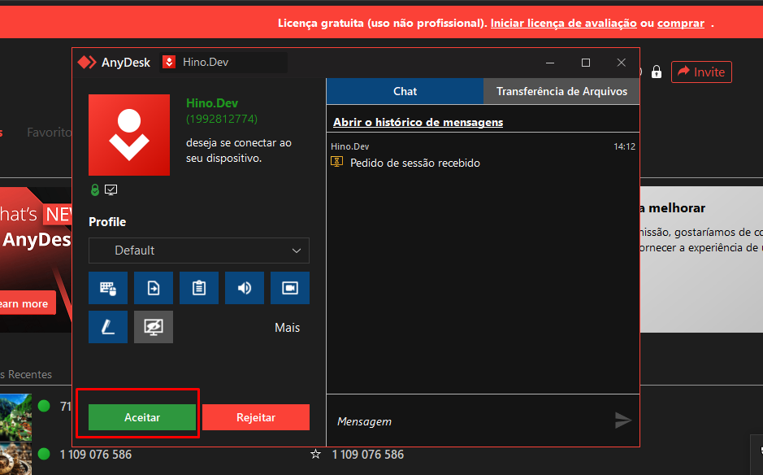

# Suporte via AnyDesk

:::info
**Modulo**: Documentos Gerais

**Objetivo**: Instalar a ferramenta Any Desk, utilizado na prestação de suporte remoto.
:::

---

Para instalar o programa AnyDesk para obter suporte remoto e permitir o acesso remoto dos consultores do Hino aos utilizadores, siga estas etapas:

**Passo 1: Baixar o AnyDesk**

- Acesse o site oficial do AnyDesk em  **[https://anydesk.com/pt](https://anydesk.com/pt)**  e clique em "Baixar Agora" ou "Download" para obter a versão adequada ao seu sistema operacional (Windows, macOS, Linux, etc.).

**Passo 2: Instalar o AnyDesk**

- Após o download, abra o arquivo de instalação e siga as instruções na tela para instalar o AnyDesk no seu computador. Geralmente, o processo de instalação é simples e direto.

**Passo 3: Obter o ID do AnyDesk**

- Depois de instalar o AnyDesk, abra o programa. Você verá um ID de nove dígitos no painel principal do AnyDesk. Esse ID é único para o seu computador e será usado pelos consultores do Hino para se conectarem remotamente.

**Passo 4: Compartilhar o ID com os consultores do Hino**

- Comunique esse ID de nove ou dez dígitos aos consultores do Hino de maneira segura. Eles precisarão deste ID para se conectar remotamente ao seu computador usando o AnyDesk.

**Passo 5: Aceitar solicitações de acesso**

- Quando os consultores do Hino tentarem se conectar ao seu computador usando o AnyDesk, você receberá uma notificação ou solicitação de acesso. Certifique-se de autorizar a conexão para permitir que eles acessem seu computador remotamente.

Certifique-se sempre de baixar o AnyDesk a partir do site oficial para garantir a segurança do seu sistema. Além disso, ao compartilhar seu ID AnyDesk, certifique-se de que está sendo feito de maneira segura e para pessoas autorizadas.

Lembre-se de que conceder acesso remoto a terceiros pode representar riscos de segurança, portanto, é importante utilizar esse tipo de ferramenta com cautela e apenas com indivíduos ou organizações confiáveis.

---