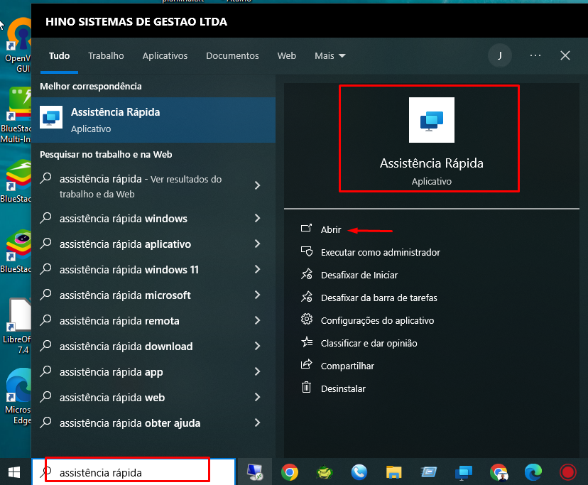
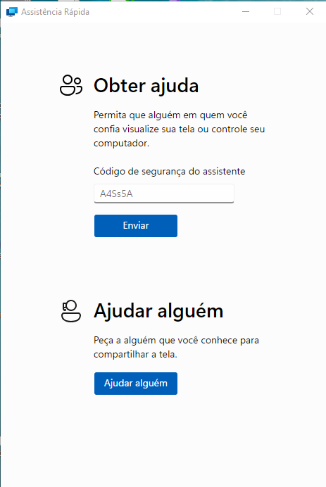
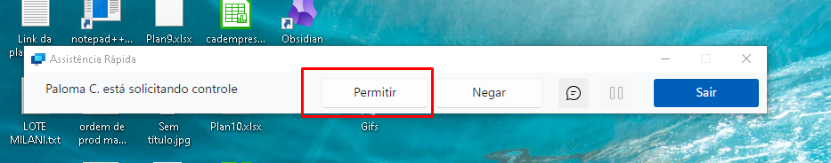

# Suporte via Assistência Rápida do Windows

:::info
**Modulo**: Documentos Gerais

**Objetivo**: Obter assistência remota através da ferramenta do Windows ‘ Assistência Rápida‘
:::

---

O Assistência Rápida do Windows é uma ferramenta que permite que um usuário forneça ou receba assistência remota de outro usuário para resolver problemas no computador. Aqui está um guia passo a passo para usar o Assistência Rápida do Windows:

### Para solicitar assistência remota (Quem precisa de ajuda):

**Passo 1: Abra o Assistência Rápida**

- Pressione as teclas `Windows` e pesquise por ‘Assistência Rápida’ e clique para abrir o aplicativo.

**Passo 2: Solicitar Assistência**

- Na janela "Assistência Rápida", insira o código fornecido pelo assitênte na área ‘Obter ajuda’ e clique em Enviar.

- Ao clicar em ‘Enviar’, aguarde até que a conexão seja realizada.

**Passo 3: Permitir o acesso do assistente no seu ambiente de trabalho**

- Clique em ‘Permitir’ para que o assistente possa visualizar sua área de trabalho.

- Eventualmente o assistente poderá solicitar o controle, aceite para permitir.

Certifique-se sempre de estar concedendo acesso remoto a pessoas confiáveis e somente quando necessário. Após a resolução do problema, encerre a sessão de assistência remota para garantir a segurança do seu sistema.

Esse procedimento usa a ferramenta Assistência Remota do Windows, que pode ser útil para suporte remoto entre usuários que estão na mesma rede ou conectados via internet, desde que ambos estejam usando o Windows.

---