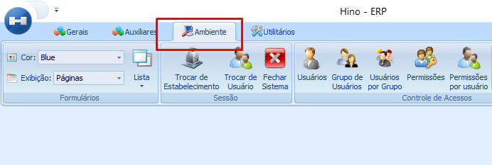
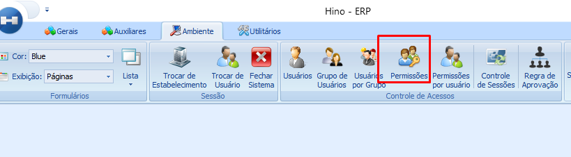
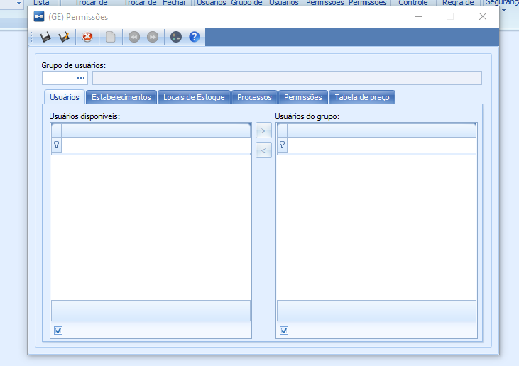
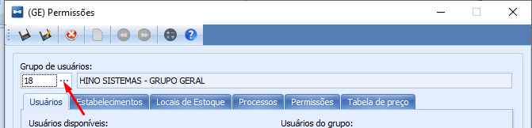

import ReactPlayer from 'react-player'

# Permissões

:::info
**Modulo**: Ambiente

**Objetivo**: Controlar o acesso de usuários ao sistema através das permissões.

**Fluxo**: Cadastro de usuários → Grupos de usuários → Permissões
:::

:::danger
**Requisitos**

1.  As permissões devem ser criadas em um momento em que nenhum usuário esteja utilizando o sistema.
2.  Os usuários devem estar cadastrados .

:::tip
Quer aprender como cadastrar um usuário? [**Clique Aqui!**](../ambiente/criacao-de-usuarios.md)
:::

1. O grupo de usuários deve estar cadastrado.

:::tip
Quer aprender como cadastrar um grupo de usuário? [**Clique Aqui!**](../ambiente/grupo-de-usuarios.md)
:::

1. Os Locais de estoque devem estar cadastrados.

:::tip
Quer aprender como cadastrar locais de estoque? [**Clique Aqui!**](../estoque/cadastrar-locais-de-estoque.md)
:::

1. Os processos operacionais devem estar cadastrados.

:::tip
Quer aprender como cadastrar processos? [**Clique Aqui!**](../../intro.md)
:::

1. As tabelas de preços devem estar cadastradas.
:::tip
Quer aprender como cadastrar tabela de preço? [**Clique Aqui!**](../../intro.md)
:::
:::

---

As permissões de usuários em um sistema ERP (Enterprise Resource Planning - Planejamento de Recursos Empresariais) são atribuições de acesso e autoridade que determinam o que cada usuário pode fazer dentro do sistema. Essas permissões são essenciais para garantir a segurança dos dados, controlar o acesso às funcionalidades e informações, e assegurar que cada usuário tenha apenas a capacidade de realizar as tarefas pertinentes às suas responsabilidades e papéis dentro da organização.

## Como Criar Permissões

**Passo 1: Acesse o módulo ‘Ambiente’**

- No menu superior clique no ícone ‘Ambiente’

**Passo 2: Clique no ícone ‘Permissões’**

- Após acessar o módulo ‘Ambiente’, clique no ícone ‘Pemissões’
 

- A tela para definição das permissões será executada

**Passo 3: Escolha o grupo de usuários.**

:::tip
Ainda não sabe como cadastrar um grupo de usuário? [Clique Aqui!](../ambiente/grupo-de-usuarios.md)
:::

- Para selecionar o grupo de usuário basta clicar campo em branco e os grupos disponíveis serão exibidos para seleção. Só é possível criar as permissões de um grupo por vez.

**Passo 4: Escolha os usuários do grupo.**

- Na aba ‘Usuários’ você verá todos os usuários cadastrados, escolha quais usuários receberão as permissões do grupo.

**Obs: Um usuário pode participar de multiplos grupos, porém os grupos mais novos podem anular permissões fornecidas em grupos mais antigos. Use com cautela.**

<ReactPlayer controls url='/videos/ambiente/configurar-permissoes.mp4'/>

**Passo 5: Escolha o estabelecimento.**

- Se a empresa tiver mais de um estabelecimento cadastrado, escolha em qual estabelecimento as permissões serão efetivadas nos usuários do grupo. Ao deixar em branco as permissões terão efeito em todos os estabelecimentos disponíveis.

<ReactPlayer controls url='/videos/ambiente/configurar-permissoes-1.mp4'/>

**Passo 6: Escolha os Locais de Estoque.**

- Uma empresa pode ter diversos locais de estoque cadastrado, escolha em qual local de estoque as permissões serão efetivadas nos usuários do grupo. Ao deixar em branco as permissões terão efeito em todos os locais de estoque disponíveis.

<ReactPlayer controls url='/videos/ambiente/configurar-permissoes-2.mp4'/>

**Passo 7: Escolha os Processos.**

- Uma empresa pode ter diversos processos cadastrado, escolha á qual processo as permissões serão efetivadas nos usuários do grupo. Ao deixar em branco as permissões terão efeito em todos os processos disponíveis.

<ReactPlayer controls url='/videos/ambiente/configurar-permissoes-3.mp4'/>

**Passo 8: Entenda como funciona as permissões.**

**Antes de definir as permissões vamos entender como elas funcionam.**

1 -  Na aba das ‘Permissões’ você vai ver todos os módulos que contém no ERP

<ReactPlayer controls url='/videos/ambiente/configurar-permissoes-4.mp4'/>

2 - Ao clicar no sinal de + de um módulo dentro das permissões, você vai ver todos os sub módulos que compõe o módulo principal.

<ReactPlayer controls url='/videos/ambiente/configurar-permissoes-5.mp4'/>

3 - Por fim ao clicar no sinal de + dentro de um sub módulo, você vai ver tudo o que pode ser permitido ou não dentro de cada sub módulo por módulo.

<ReactPlayer controls url='/videos/ambiente/configurar-permissoes-6.mp4'/>

### Conclusão

As permissões do sistema seguem um esquema de árvore e com isso é possível definir os módulos e o que os usuários farão dentro de cada módulo.

**Passo 9: Definição das permissões.**

- Para definir as permissões, clique nas caixas de seleção. Considere tudo o que os usuários realmente poderão realizar dentro de cada módulo.

**Atenção: As definições das permissões é uma das ações mais importantes pois vai controlar todo acesso do utilizador ao sistema. Realize esse processo com calma e atenção.**

<ReactPlayer controls url='/videos/ambiente/configurar-permissoes-7.mp4'/>

**Passo 10: Escolha da tabela de preço**

- Algumas empresas precisam dar acesso aos usuários em tabela de preços específicas. As tabelas de preços são usadas para registrar o preço de venda de um produto. Para definir a tabela que será aplicada as permissões basta passar as tabelas desejadas para a direita, se deixar em branco o grupo terá acesso a todas as tabelas disponíveis.

<ReactPlayer controls url='/videos/ambiente/configurar-permissoes-8.mp4'/>

**Passo 11: Salvar as configurações**

- Após definir todas as configurações para o grupo, clique em salvar. A janela irá fechar e as permissões estarão prontas.

<ReactPlayer controls url='/videos/ambiente/configurar-permissoes-9.mp4'/>

---