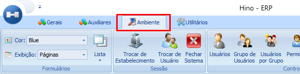
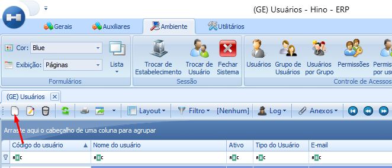

# Criação de Usuários - ERP

:::info
**Modulo**: Ambiente

**Objetivo**: Realizar cadastros de usuários
:::

1 - Deve existir ao menos um usuário controlador com permissão de administrador, este vai ser responsável pelos demais cadastros. Caso não exista solicite aos consultores que realizem a liberação para um usuário controlador.

:::tip
Quer saber o que é um usuário controlador? [**Clique Aqui!**](../../documentos-gerais/usuarios-chave.md)
:::

---

# Como Cadastrar Usuários

**Passo 1: Acesse o módulo ‘Ambiente’**

- Na menu superior, clique sobre o módulo ‘Ambiente’

**Passo 2:  Clique no ícone ‘Usuários’**

- No módulo ‘Ambiente’ clique no ícone ‘Usuários’

**Passo 3: Clique no ícone de ‘Novo’**

- Sem que precisar criar um novo registro, basta clicar no ícone ‘Novo’ indicado pela seta.

- Uma tela para cadastro do usuário será aberta

**Passo 4: Preencha os dados para a criação do usuário**

- Preencha os dados principais para a criação do usuário

- Os dados principais são; **Código do usuário**, **Nome do usuário** e **E-mail**. Se o usuário cadastrado for um administrador ou seja se ele for o tipo de usuário que vai ter acesso a todos os módulos e funções do sistema independente das permissões, marque a caixa ‘Administrador’.

:::tip
Quer aprender como definir as permissões dos usuários? [**Clique Aqui!**](configurar-permissoes.md)
:::

