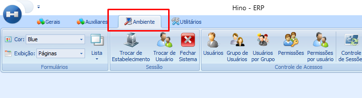
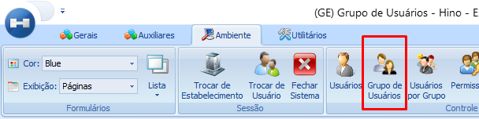
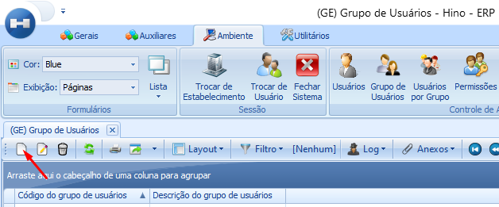
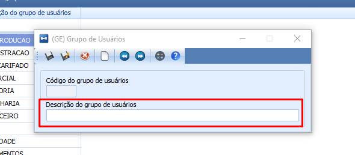
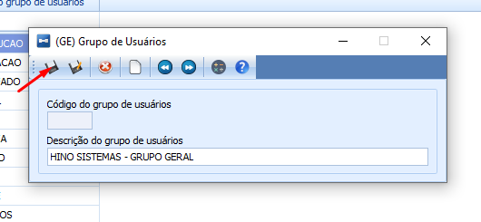

# Grupo de Usuários

:::info
**Modulo**: Ambiente

**Objetivo**: Definir grupos de usuários através dos setores e ou atribuições 
:::

---

Os grupos de usuários são conjuntos que categorizam usuários com base em setores ou funções dentro de uma empresa. Essa abordagem permite conceder permissões de maneira coletiva, simplificando o controle de acesso ao sistema. Ao atribuir permissões a um grupo, elas automaticamente se aplicam aos usuários nele inseridos, garantindo consistência e facilitando a gestão das autorizações conforme as demandas específicas de cada grupo.

## Como cadastrar um Grupo de Usuários

**Passo 1: Acesse o módulo ‘Ambiente’**

- No menu superior clique no ícone ‘Ambiente’

**Passo 2: Clique no ícone ‘Grupo de Usuários’**

- Dentro do módulo ‘Ambiente’, clique no ícone ‘Grupo de Usuários’

**Passo 3: Clique em ‘Novo’**

- Clique em ‘Novo’ para cadastrar um novo grupo

**Passo 4: Defina o nome do grupo**

- O nome dos grupos de usuários varia conforme a definição estabelecida pela empresa. Algumas empresas optam por denominar grupos com base nos setores, enquanto outras preferem fazê-lo de acordo com funções específicas ou até mesmo nomear com base em cada usuário individual. Ambos os métodos são viáveis.

Por exemplo, um grupo "VENDAS" pode ser criado, onde todos os vendedores têm as mesmas permissões. Além disso, é possível ter um grupo denominado "João", exclusivo para o usuário João, com permissões específicas ajustadas somente para ele. Essa flexibilidade permite atribuir permissões de maneira abrangente, oferecendo uma abordagem ampla para grupos com funcionalidades compartilhadas e, ao mesmo tempo, a capacidade de criar grupos personalizados para usuários individuais conforme necessário.

**Passo 5: Clique em ‘Salvar’**

- Após preencher a descrição do grupo de usuários clique em ‘Salvar’

