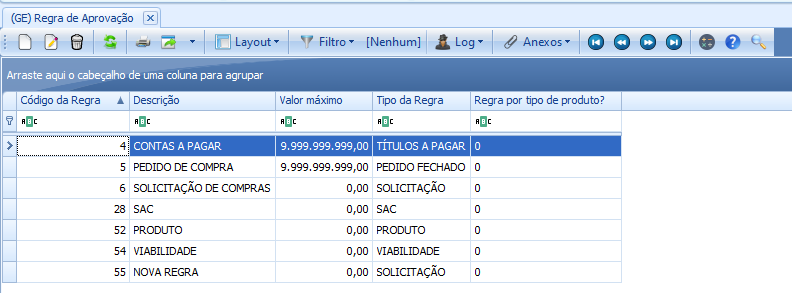

# Regra de aprovação

:::info
**Modulo**: Ambiente

**Objetivo**:  O objetivo da regra de aprovação é dizer para o ERP qual utilizador pode realizar a inclusão e aprovação de Solicitação de Compra e Pedido de Compra.
:::

:::danger
**Requisitos** 
Para criar uma regra de aprovação com os utilizadores desejados, os utilizadores precisam estar cadastrados em **USUÁRIOS**. Saiba como cadastrar um novo usuário [**clicando aqui.**](https://www.notion.so/Cria-o-de-Usu-rios-para-o-ERP-5e14acced9604d91b8f8c69f85154cb5?pvs=21) 
:::
---

Clique em ‘Ambiente’ → ‘Regra de Aprovação’

A tela com as regras de aprovações realizadas no tempo de implantação serão exibidas.

:::warning
Caso não tenha nenhuma regra pronta será preciso criar uma, o processo para inserir usuários em uma regra já existente ou em uma regra criada do zero são os mesmos.
:::

Selecione a regra desejada clicando sobre ela e clique em ‘Editar’ 

Ou clique em ‘Novo’ para criar uma nova regra.

Observe que ao editar uma regra existente, ou iniciar a criação de uma nova regra, as telas de saída são as mesmas. A diferença é que ao editar uma regra existente iremos alterar os usuários que participa dessa regra seja incluindo ou excluindo e ao iniciar uma regra nova precisamos dizer onde essa regra será aplicaca; Pedidos de Compras, Solicitação etc…

---

Se optar por criar uma nova regra Clique Aqui!

Se optar por editar uma regra existente Clique Aqui!

Clique em ‘Novo’ para criar uma nova regra.

A tela para a criação de uma nova regra será exibida

Realize o prenchimento das informações 

Clique no sinal de adição para incluir os usuários que farão parte dessa nova regra.