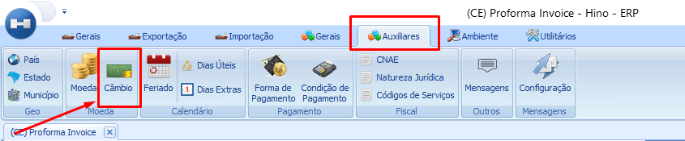
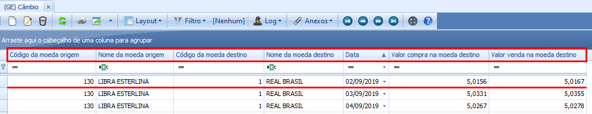
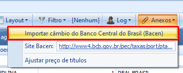
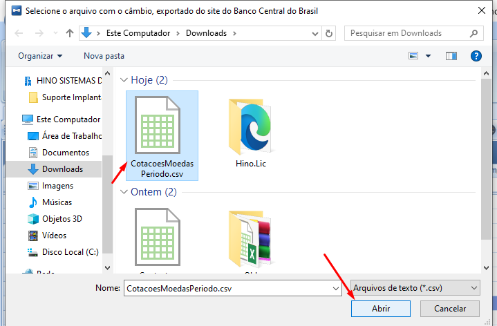
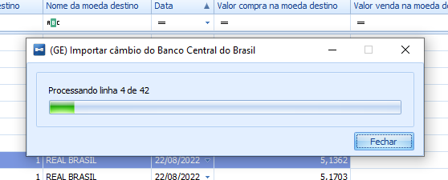
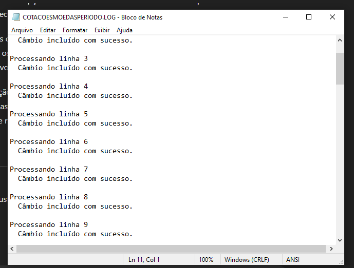

# Atualização da cotação de moeda internacional

:::info
**Modulo**: Auxiliares

**Objetivo**: Capacitar o usuário para instruí-lo quanto às classificações dos produtos no ERP
:::

:::danger
**Requisitos:** 

Ter os cadastros das moedas que serão utilizadas importadas no sistema.
Possuir o arquivo com as cotações da Moeda no Banco Central 
:::

:::tip
Aprenda a como realizar o download das cotações do Banco Central, [**clicando aqui**](download-arquivo-bacen.md).
:::

Clique na aba “AUXILIARES” 

Clique em “Câmbio”

O sistema exibirá uma lista de todas as moedas cujas cotações foram incluídas no sistema a partir dos dados do Banco Central

A atualização das moedas é feita por meio da importação da cotação fechada do dia anterior, que é fornecida em forma de planilha pelo site do Banco Central. Após obter a planilha, ela é importada para o sistema. 

Agora, vamos importar a planilha 

Clique em anexos → Importar câmbio

Você será direcionado para a sua pasta de “Downloads” → Selecione a planilha que você baixou e clique em “ABRIR”

O sistema exibirá que está carregando os dados 

Ao finalizar a importação do arquivo no sistema, clique em “OK”. 

O sistema abrirá um bloco de notas mostrando quais “linhas” ou cotações foram integradas. Caso haja alguma cotação que já estivesse no sistema, o bloco de notas informará que ela não foi integrada novamente, pois já estava registrada.

→ Após revisar o bloco de notas, você pode fechá-lo e retornar ao sistema, onde a lista de câmbio estará atualizada com as novas cotações que foram incluídas 