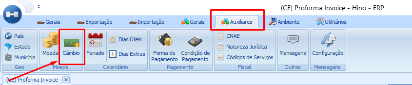
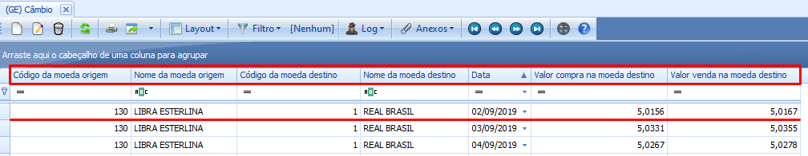
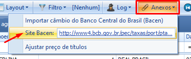
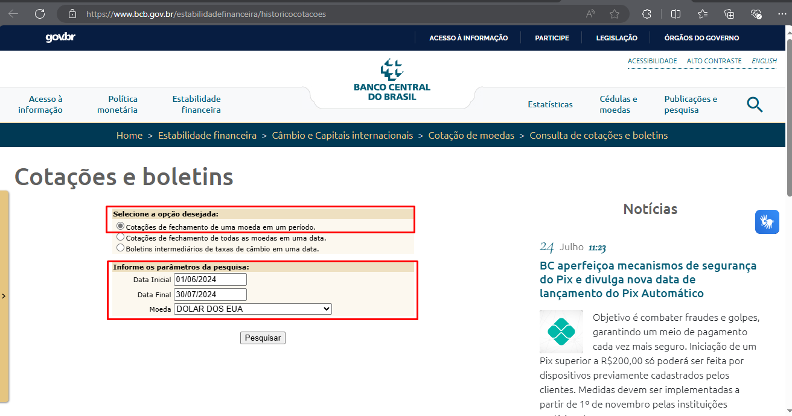
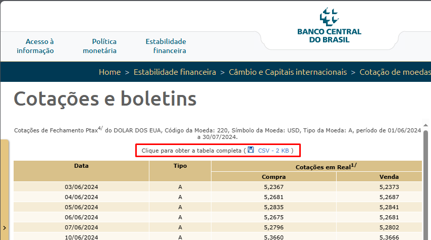
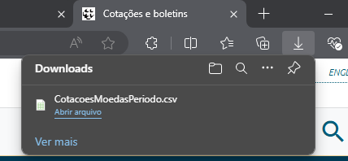

# Como Baixar o Arquivo em Excel das Cotações de uma Moeda no Banco Central

:::info
**Modulo**: Auxiliares

**Objetivo**: Capacitar o usuário para instruí-lo quanto às classificações dos produtos no ERP
:::

Clique na aba “AUXILIARES” 

Clique em “Câmbio”

O sistema exibirá uma lista de todas as moedas cujas cotações foram incluídas no sistema a partir dos dados do Banco Central

A atualização das moedas é feita por meio da importação da cotação fechada do dia anterior, que é fornecida em forma de planilha pelo site do Banco Central. Após obter a planilha, ela é importada para o sistema. 

Agora, vamos pelo sistema acessar o banco central e pegar uma nova cotação de moeda internacional 

Clique em anexos → Clique no link disponível na opção “Site Bacen”

 O sistema irá redirecioná-lo para o site do Banco Central. Mantenha selecionada a opção “Cotações de Fechamento de uma Moeda em um Período”.

→ Informe os parâmetros de pesquisa, como o período que deseja verificar e a moeda. É importante garantir que essas informações estejam sempre atualizadas no sistema.

Clique em pesquisar 

Você verá os valores de fechamento da moeda escolhida para compra e venda.

→ 

Clique no arquivo CSV-2KB 

Em seguida, você fará o download do arquivo Excel com as cotações do período pesquisado. 

