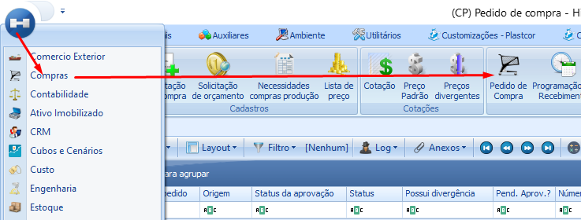
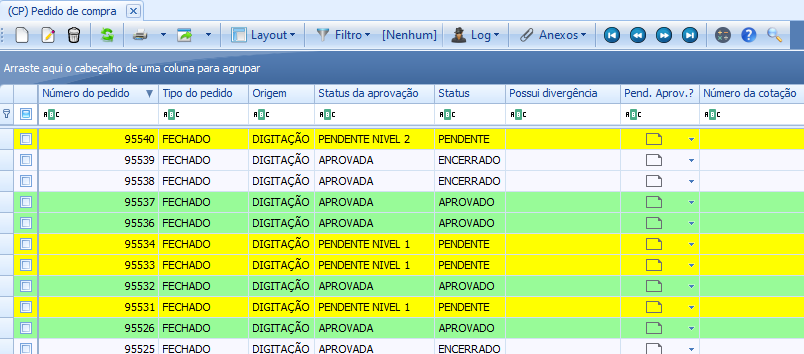

# Pedido de Compras

:::info
**Modulo**: Compras

**Objetivo**:  Registrar um pedido de compras no ERP
:::

:::danger
**Requisitos** 
Para realizar a inclusão de um pedido de compras o utilizador precisa estar em uma **REGRA DE APROVAÇÃO**. Para ver como criar uma regra de aprovação [clique aqui](../ambiente/regra-de-aprovacao.md).
:::

---

Clique em Menu → Compras → Pedido de Compras

A tela com todos os pedidos de compras nas diversas situações será exibida.

Clique em ‘NOVO’ para realizar um novo pedido