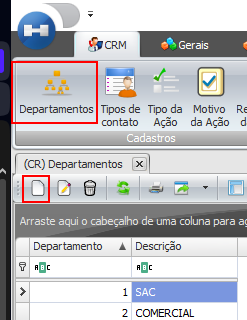
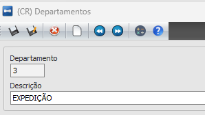

# Departamentos

Nesta tela o usuário poderá cadastrar os departamentos da empresa.

Ao acessar a tela de departamentos, o usuário deverá clicar em novo e informar o numero do departamento e a descrição:

