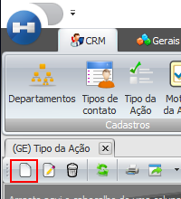
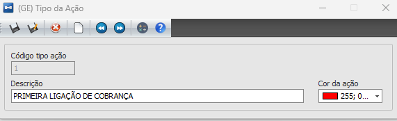

# Tipo da Ação

:::info
**Modulo**: CRM

**Objetivo**:  O objetivo é realização de cadastros de Tipos de Ações do módulo CRM e a manutenção dos mesmos.
:::

---

Na tela de Tipo da Ação, o usuário deverá cadastrar as ações que serão realizadas pela equipe do comercial.

Para isso o usuário deverá clicar em novo e informar uma descrição e cor da ação.

---