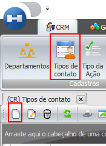
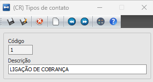

# Tipos de Contatos

:::info
**Modulo**: CRM

**Objetivo**:  O objetivo é realização de cadastros de Tipos de Contatos do módulo CRM e a manutenção dos mesmos.
:::

---

Em Tipos de Contato o usuário deverá cadastrar os tipos de ligações e contatos que serão realizados com o cliente.

Para criar um novo tipo, o usuário deverá acessar a tela e clicar em novo e informar o código e a descrição:

---