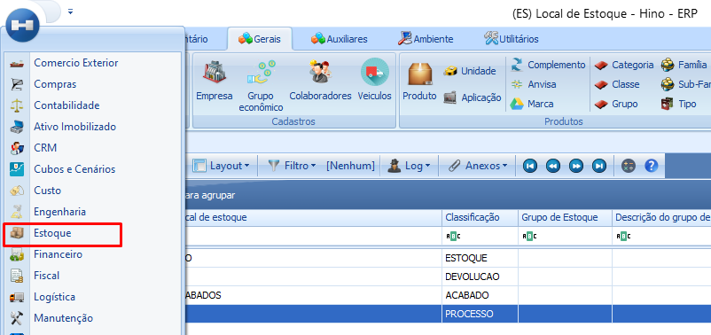
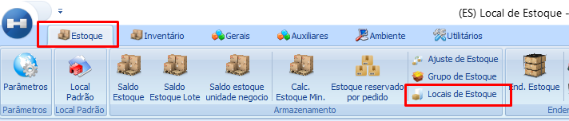
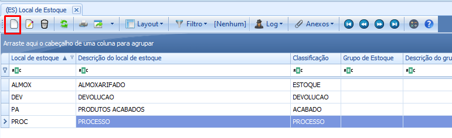
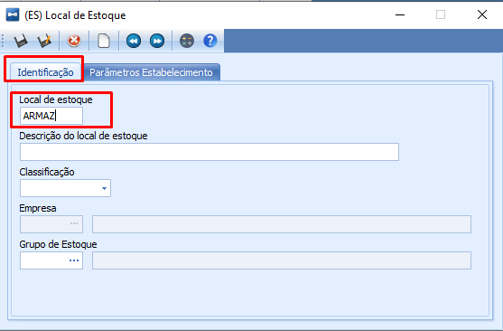
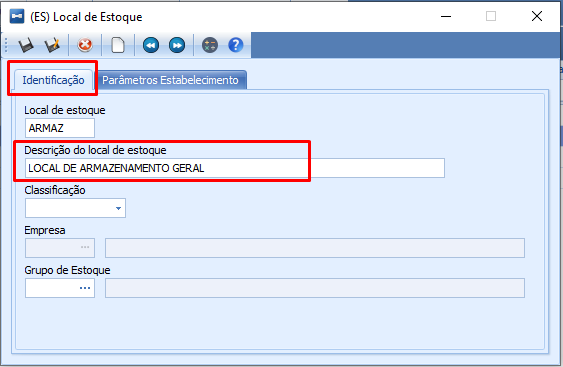
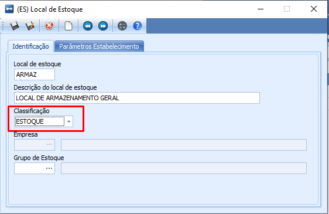
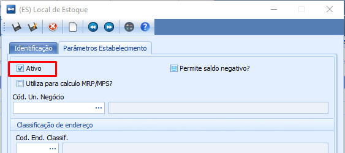
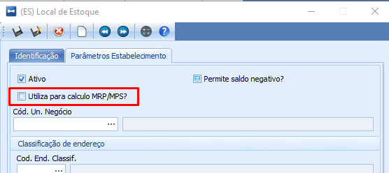
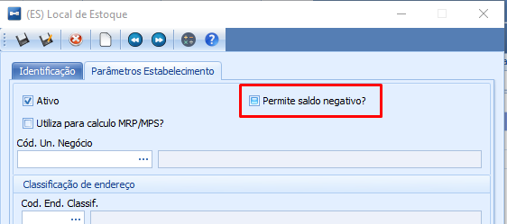
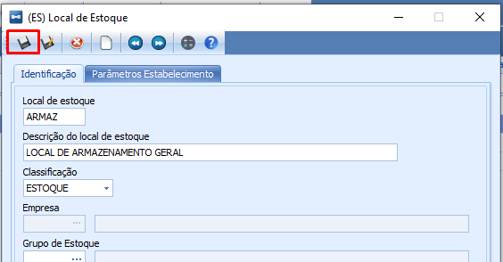

# Cadastrar Locais de estoque

:::info
**Modulo**: Estoque

**Objetivo**: Cadastrar locais de estoque
:::

---

Vamos explorar como é possível cadastrar locais de estoque para diferentes cenários, independentemente dos locais pré-definidos no ERP.

:::tip
Não sabe sobre os Locais Pré Definidos? [Clique Aqui!](locais-de-estoque.md)
:::

## Sequência para criar locais de estoque

**Passo 1: Acesse o módulo ‘Estoque’**

- Através do meno lateral esquerdo, acesse o módulo de estoque

**Passo 2: Clique em ‘Locais de Estoque’**

- Já dentro do módulo ‘Estoque’, localize e clique em ‘Locais de Estoque’

**Passo 3: Inicie um novo cadastro**

- Agora na tela de ‘Locais de Estoque’, clique em ‘Novo’ para dar início a um novo cadastro

**Passo 4: Preencha os dados na aba ‘Identificação’**

- **Preencha o campo ‘Local de estoque’**

Esse campo é o código do local que você está cadastrando

- **Escolha a descrição para o local**

Escolha a descrição que melhor identifique o local que está sendo criado

- **Escolha a classificação**

O propósito do local de estoque é determinado pela sua classificação. Certifique-se de escolher a classificação apropriada ao criar um novo local.

**Passo 5: Defina os parâmetros do local de estoque**

- Para configurar o novo local de estoque, siga estes passos na aba 'Parâmetros do Estabelecimento':

Marque 'Ativo' para habilitar o local em questão.

Se desejar que o sistema considere esse local para o cálculo de Necessidades de Compras e Produção, selecione 'Utiliza para cálculo MRP/MPS'.

Caso permita que o local tenha saldo negativo quando não houver quantidade disponível, selecione 'Permite saldo negativo'."

**Passo 6: Salve o novo local**

Após preencher os campos e definir os parâmetros clique em salvar.

📢 É importante ressaltar que a diferenciação entre os locais de estoque está na sua classificação. Portanto, ao criar um novo local, certifique-se de utilizar a classificação adequada de acordo com o propósito específico desse local.

:::tip
Não sabe qual classificação utilizar? [Clique Aqui!](locais-de-estoque.md)
:::

---