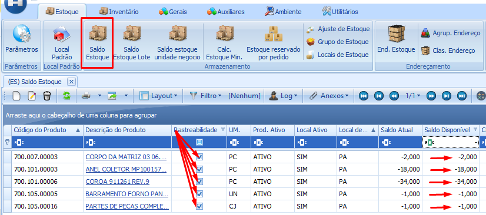
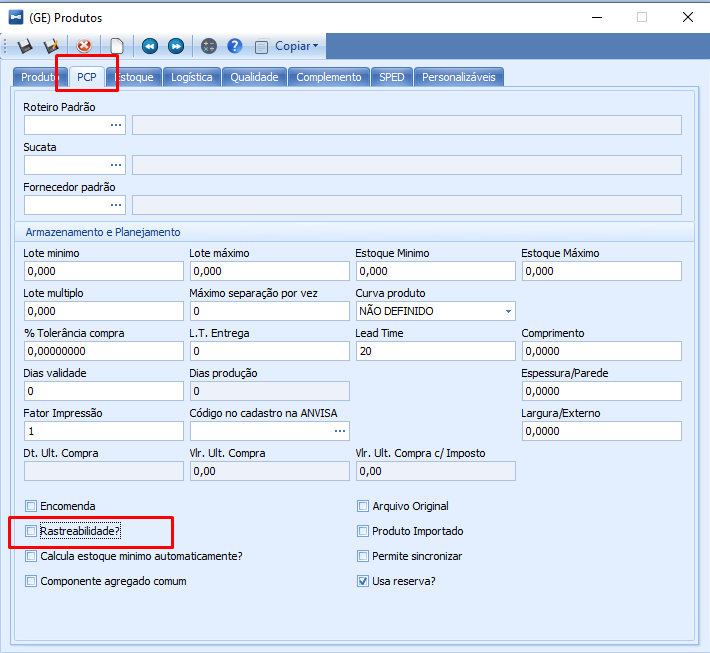

import ReactPlayer from 'react-player'

# Correção de Saldos com Lote

:::info
**Modulo**: Estoque

**Objetivo**: Corrigir saldo com lotes

**Fluxo**: Zerar saldo com lote → desmarcar rastreabilidade → Zerar saldo sem lote → remarcar rastreabilidade → Incluir saldo em lote
:::

---

## **Procedimento para Correção de Saldos Impactando Produtos com Lote de Forma Indevida**

**Premissa Inicial**: Considerando que um produto com **lote** **não pode ter** um **saldo negativo**, conclui-se que o saldo que afeta um produto com lote, na realidade, refere-se a um saldo sem vínculo a lotes específicos.

---

## Procedimento para correção

**Passo 1**: Inicie com um ajuste de estoque ou inventário para zerar os saldos dos lotes disponíveis relacionados ao produto afetado.

:::tip
Não sabe como realizar um ajuste? [**Clique Aqui!**](fazer-ajuste-de-estoque.md)
:::

:::tip
Não sabe como realizar um inventário? [**Clique Aqui!**](inventario.md)
:::

**Passo 2**: No cadastro do produto afetado, desmarque a opção de rastreabilidade, removendo a associação com lotes.

- Acesse o cadastro de produto clicando em ‘Gerais’ em seguida ‘Produto’ localize o produto e clique em editar, na aba ‘PCP’ desmarque a caixa ‘Rastreabilidade’.

<ReactPlayer playing controls url='/videos/estoque/correcao-saldo-de-estoque.mp4'/>

Ou se preferir na tela de ‘Saldo Estoque’ faça um duplo clique sobre o link do produto para acessar o cadastro.

<ReactPlayer playing controls url='/videos/estoque/correcao-saldo-de-estoque-1.mp4'/>

**Atenção: Só é possível desmarcar ‘Rastreabilidade’ após zerar o saldo existente nos lotes disponíveis para o produto.**

**Passo 3:** Execute um novo ajuste ou inventário para zerar os saldos, agora considerando que o produto não possui rastreabilidade de lotes.

:::tip
Não sabe como realizar um ajuste? [**Clique Aqui!**](fazer-ajuste-de-estoque.md)
:::

:::tip
Não sabe como realizar um inventário? **Clique Aqui!**
:::

**Passo 4**: Após a conclusão do ajuste, restabeleça a rastreabilidade marcando novamente essa opção no cadastro do produto.

**Passo 5**: Realize um ajuste ou inventário específico para inserir os saldos nos lotes desejados, uma vez que a rastreabilidade foi restabelecida.

:::tip
Não sabe como realizar um ajuste? [**Clique Aqui!**](fazer-ajuste-de-estoque.md)
:::

:::tip
Não sabe como realizar um inventário? **Clique Aqui!**
:::

:::danger
⛔ Certifique-se de seguir atentamente cada passo, pois este procedimento foi elaborado para corrigir situações em que os saldos incorretos afetam produtos com lote devido à falta de vinculação a lotes específicos.
:::

---