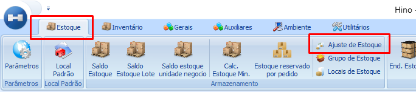
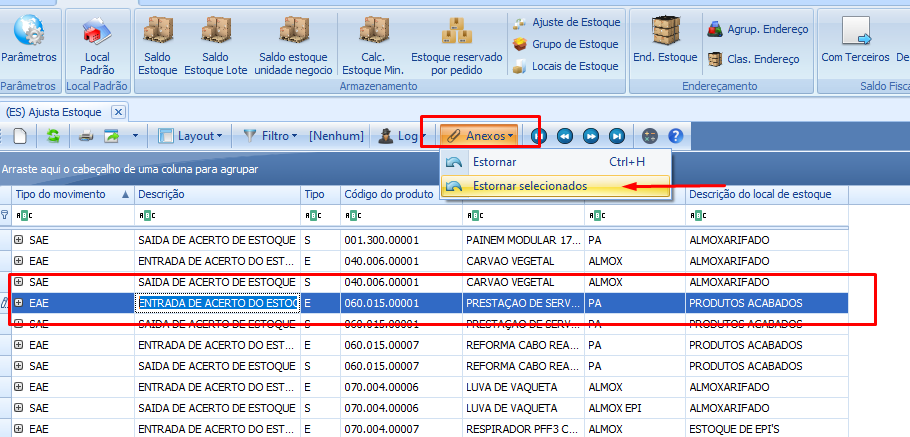
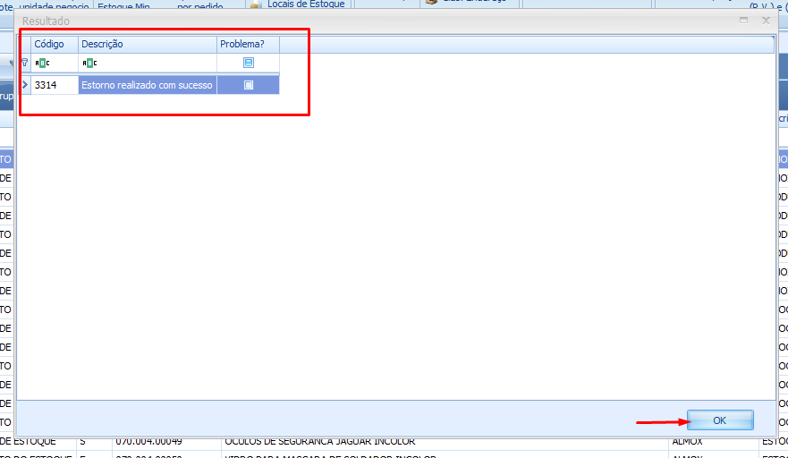

import ReactPlayer from 'react-player'

# Desfazer um ajuste de saldo

:::info
**Modulo**: Estoque

**Objetivo**: Desfazer ajuste de estoque
:::

:::danger
**Requisitos**

Precisa saber o código do produto que será feito a reversão do ajuste.
:::

---

Em algumas situações, pode ser necessário reverter um ajuste de saldo no sistema por diferentes motivos. É crucial manter atenção especial a esses procedimentos para evitar confusões entre os ajustes feitos e os estornos realizados. O ideal é manter um controle rigoroso do estoque para minimizar ao máximo a ocorrência desses movimentos de reversão.

## Como reverter (Estornar) um ajuste de saldo de estoque

**Passo 1: Acesse o módulo ‘Estoque’**

- No módulo de ‘Estoque’ clique no ícone ‘Ajuste de Estoque’

**Passo 2: Selecione um registro para iniciar**

- A tela que é exibida a seguir mostra todos os registros  de ajustes já realizados até o momento para os produtos e local de estoque. Selecione qualquer registro clicando sobre o mesmo e em seguida clique no botão ‘**Anexos**’ e clique na opção ‘**Estornar Selecionados**’

**Passo 3: Localize o produto**

- Use os filtros para localizar o produto e todos os ajustes realizados para o mesmo. Em seguida marque a caixa de seleção no ajuste que deseja reverter e clique em ‘OK’, então o ajuste será estornado com sucesso.

<ReactPlayer playing controls url='/videos/estoque/desfazer-ajuste-de-estoque.mp4'/>

- Confirme clicando em Ok

---
