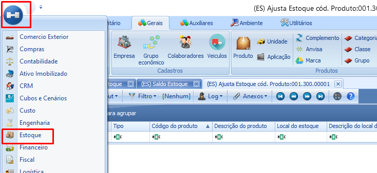
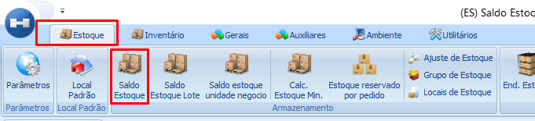
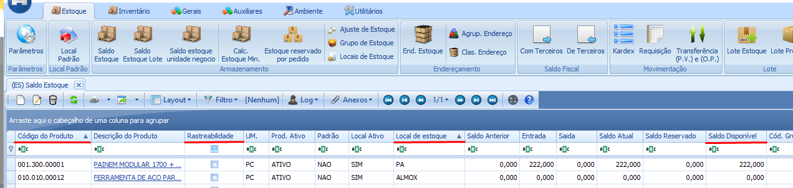
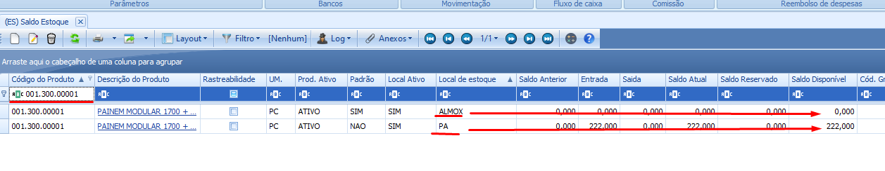
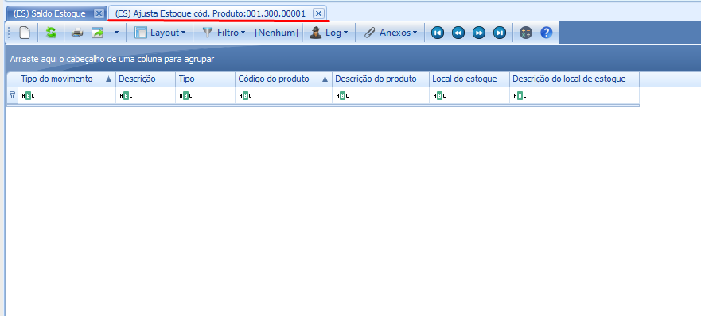
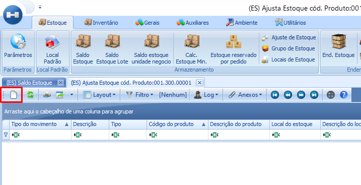
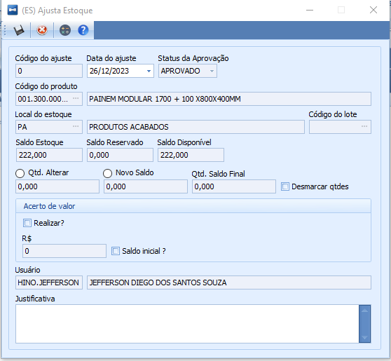
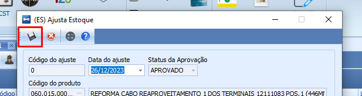

import ReactPlayer from 'react-player'

# Realizar um Ajuste de Saldo

:::info
**Modulo**: Estoque

**Objetivo**: Realizar o acerto do saldo de estoque através de ajuste.
:::

:::danger
**Requisitos**

Em ‘**Tipo da Movimentação**’ os movimentos de ‘**Entrada de Acerto do Estoque**’ e **‘Saída de Acerto do Estoque**’ devem estar cadastrados
:::

:::tip
Quer aprender a cadastrar ‘Movimentos Fiscais’? Clique Aqui!
:::

---

Realizar ajustes nos saldos em estoque de uma empresa pode ser necessário devido a diferentes fatores. No entanto, é fundamental implementar práticas sólidas de controle de estoque para minimizar ao máximo a ocorrência desses ajustes. É importante destacar que, embora os ajustes possam corrigir discrepâncias, eles não substituem o processo de inventário.

## Como fazer um ajuste nos saldos em estoque

**Passo 1: Acesse o módulo de ‘Estoque’**

- Clique em Menu, Estoque para acessar o módulo

**Passo 2: Clique no ícone ‘Saldo Estoque’**

- Após acessar o módulo de estoque, clique no ícone ‘Saldo Estoque’

**Passo 3: Pesquise o produto e local de estoque**

- Na tela de Saldo Estoque, você vai ver uma infinidade de linhas separadas por várias colunas. Cada linha é um registro para um produto com as características das colunas no módulo de estoque.

As colunas principais para nosso objetivo são;  ‘**Código do produto**’, ‘**Rastreabilidade**’, ‘**Local de estoqu**e’ e **‘Saldo disponível**’

- Utilize o filtro para encontrar o produto que deseja ajustar o saldo.

Ao filtrar pelo ‘Código do produto’ o sistema me mostra duas linhas para o produto filtrado, posso ver que existem dois locais de estoque disponíveis e isso significa que em algum momento o produto filtrado passou por esses locais de estoque.

É possível ver também que o saldo disponível para o produtos nesses locais são diferentes.

**Passo 4: Selecione o registo** 

- Selecione o registro de acordo com o local de estoque que deseja ajustar. Para selecionar um registro basta clicar uma vez sobre a linha.
- 

<ReactPlayer playing controls url='/videos/estoque/selecione_o_registro.mp4'/>

**Passo 5: Realize o ajuste**

- Clique em Anexos e selecione a opção ‘Ajuste de Estoque’

Vai ser aberta uma tela com os registros de ajustes que já foram realizados pra o produto e local de estoque selecionado.

- Clique em ‘Novo’ para iniciar um novo ajuste

- Preencha a tela de ajuste de acordo com o desejado

- Clique em Salvar

Após prencher a tela de ajuste de acordo com o desejado, clique para salvar.

## Explicando a tela e realizando o ajuste.

### Ajuste em produtos sem Lotes

Quando você iniciar o processo de ajuste, você vai ter acesso a tela de ajuste . No vídeo abaixo explicarei sobre a essa tela e irei realizar o ajuste para produtos sem Lotes.

:::warning
📺 Atenção !

O vídeo a seguir contém áudio. Por favor, ajuste suas configurações de áudio, conecte seus alto-falantes ou fones de ouvido para ouvir a explicação fornecida. Se preferir, assista através de um dispositivo que permita a reprodução do áudio para obter informações completas e detalhadas.
:::

<ReactPlayer playing controls url='/videos/estoque/Ajuste_sem_lote.mp4'/>

---

### Ajuste em produtos com Lotes

Quando você iniciar o processo de ajuste, você vai ter acesso a tela de ajuste . No vídeo abaixo explicarei sobre a essa tela e irei realizar o ajuste para produtos com Lotes .

:::warning
📺 Atenção !

O vídeo a seguir contém áudio. Por favor, ajuste suas configurações de áudio, conecte seus alto-falantes ou fones de ouvido para ouvir a explicação fornecida. Se preferir, assista através de um dispositivo que permita a reprodução do áudio para obter informações completas e detalhadas.
:::

<ReactPlayer playing controls url='/videos/estoque/Ajuste_com_lote.mp4'/>

---