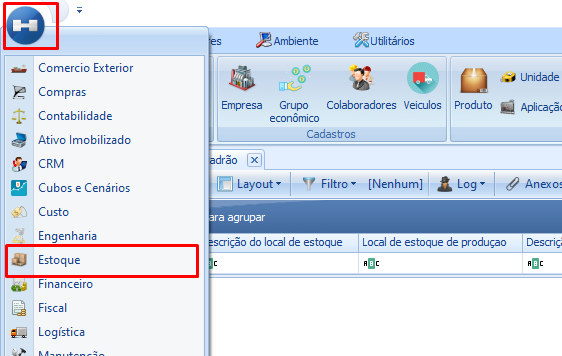

import ReactPlayer from 'react-player'

# Informar local padrão
 
:::info
**Modulo**: Estoque

**Objetivo**: Definir os locais de estoque padrão
:::

:::danger
**Requisitos**

1 - Os locais de estoque devem estar cadastrados com status ‘Ativo’
:::

:::tip
Quer aprender a cadastrar locais de estoque? [**Clique Aqui!**](https://www.notion.so/Locais-de-Estoque-eb53ccfe1d4b4ed58f601496acbbaa87?pvs=21)
:::

---

:::warning
💡 O Local Padrão no módulo de estoque tem a finalidade de orientar o sistema sobre onde direcionar o saldo para diferentes situações previsíveis. A escolha do Local Padrão pode variar conforme a preferência e processo específico de cada empresa. Não há uma regra fixa, apenas a necessidade de definir o Local Padrão para instruir o sistema a movimentar o saldo nas seguintes situações, caso a empresa siga esses processos:
:::

- **Local de Recebimento:**
    
    Destino dos produtos provenientes do recebimento por nota fiscal.
    
- **Local de Produção:**
    
    Destino para produtos originados por ordens de produção.
    
- **Local de Inspeção de Terceiro:**
    
    Armazena produtos de terceiros que entram na empresa e possuem cadastro de inspeção.
    
- **Local de Reprovados:**
    
    Destino dos produtos reprovados durante a inspeção.
    
- **Local de Solicitação:**
    
    Destino dos produtos aguardando a emissão de uma nota fiscal devido a uma solicitação.
    
- **Local de Inspeção 200%:**
    
    Destino para produtos com cadastro de inspeção em 200%.
    
- **Local de Reprovação 200%:**
    
    Destino dos produtos reprovados em inspeção com 200% de critérios.
    

Essas definições garantem que o sistema saiba para onde direcionar o saldo com base nas operações esperadas, facilitando os processos de movimentação de estoque conforme a necessidade da empresa.

## Definindo o Local Padrão

     **Passo 1: Acesse o módulo de estoque**

- No menu lateral localize e clique no módulo de estoque.

**Passo 2: Acesse ‘Local Padrão**

- Após entrar no módulo de estoque localize em clique em ‘**Local Padrão**’

**Passo 3: Clique em novo**

- Após acessar ‘**Local Padrão**’ clique em ‘**Novo**’ para iniciar os vínculos.

**Passo 4: Escolha os locais**

- Para cada processo padrão, escolha o local de estoque . Após realizar a definição clique em salvar.

<ReactPlayer playing controls url='/videos/estoque/localpadrao.mp4' />

---
