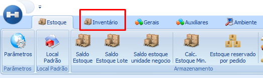
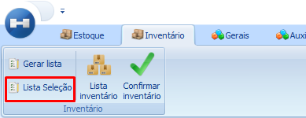
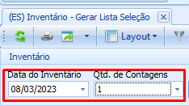
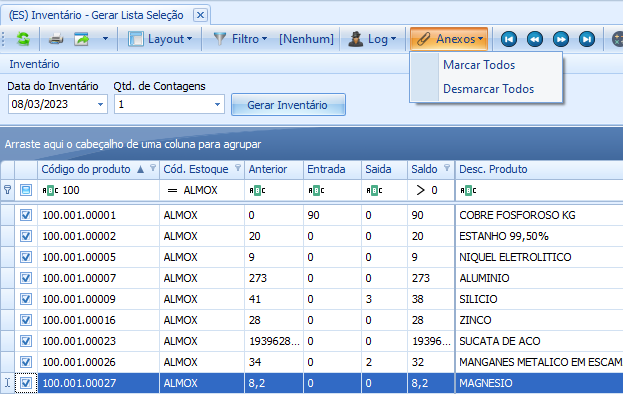
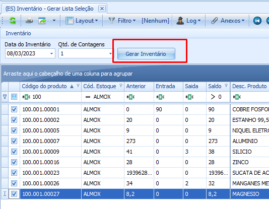
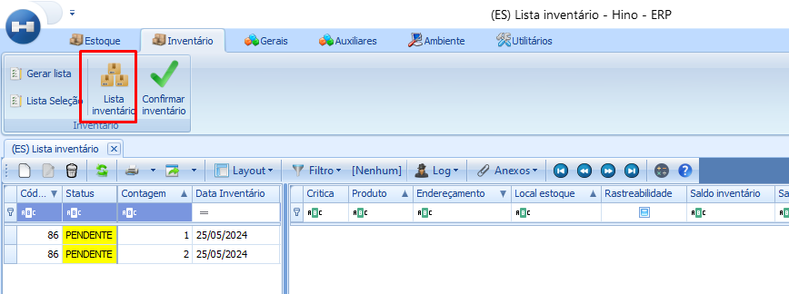

import ReactPlayer from 'react-player'

# Como realizar o inventário - Lista de seleção

Uma das formas mais comuns de realizar um inventário é através da lista de seleção. Lista de seleção por que você consegue selecionar de acordo com os critérios desejados os produtos que você deseja inventáriar.

Lembre-se de que o objetivo principal do inventário é inserir no sistema o saldo de todos os produtos de todos os tipos que você tem no estoque físico. Uma das vantagens de ralizar o inventário através da lista de seleção é de poder reliza-lo de maneira fracionada o que permite um melhor controle e organização de acordo com as necessidades de cada empresa.

Após realizar o inventário, garanta através dos processos o controle do saldo de estoque para que o esforço empreendido na tarefa de realizalção das contagens não seja invão.

## Como realizar o inventário

Clique em Menu → Estoque → Inventário

Clique em Lista Seleção

Informe a data que está sendo realizado o inventário e quantidade de contagens que vai ser feita.

:::warning
A quantidade de contagens se refere a quantas contagens físicas serão realizadas para os produtos que serão inventáriados
:::

Utilize o grid para filtrar e localizar os produtos que você quer acertar no estoque e marque a caixa. Se quiser use os anexos para marcar todos de uma vez.

<ReactPlayer playing controls url='/videos/estoque/InventLista1.mp4'/>

Depois de configurada a data e selecionado os produtos clique em gerar inventário.

Impressão das Listas de Contagens

<ReactPlayer playing controls url='/videos/estoque/InventLista2.mp4'/>

Inclusão das contagens e efetivação do inventário. Ao clicar na lista pendente, na linha do produto na coluna Saldo inventário insira a quantidade de acordo com a contagem física realizada.

<ReactPlayer playing controls url='/videos/estoque/InventLista3.mp4'/>

---