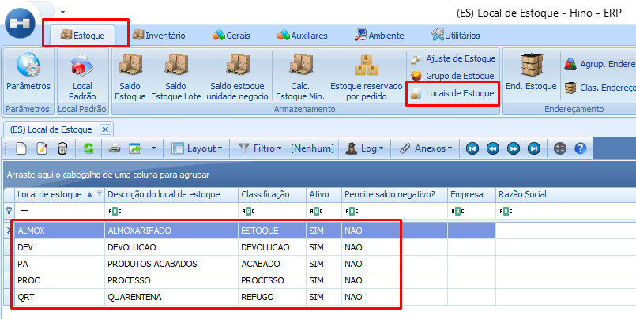
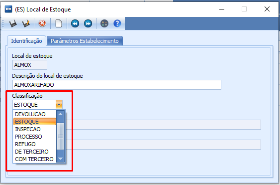

# Sobre os Locais de Estoque

:::info
**Modulo**: Estoque

**Objetivo**: Aprender sobre os locais de estoque
:::

---

Os locais de estoque dentro do ERP desempenham um papel fundamental ao registrar e controlar todas as movimentações de um produto durante a execução de processos. Eles servem como um reflexo da movimentação física dentro das instalações da empresa. Alguns desses locais de estoque são temporários, vinculados a processos específicos, enquanto outros são estáticos e fixos.

É importante ressaltar que, durante um processo, um produto pode transitar por diversos locais de estoque, conforme o planejamento operacional da empresa. Essa dinâmica reflete a necessidade de acompanhar e gerenciar o fluxo do produto ao longo das etapas do processo corporativo.

## Locais Pré-Definidos

- Durante a fase inicial de implantação do software na empresa, alguns locais de estoque já vêm pré-habilitados e classificados para uso. Estes incluem: **Almox** (Almoxarifado), **Dev** (Devolução), **PA** (Produto Acabado), **Proc** (Processos) e **QRT** (Quarentena).

**Almox**: Local onde todos os tipos de produtos exceto acabados podem ser armazenados. Por exemplo: insumos, material de uso e consumo, componentes, materia prima etc…

**Dev**: Local onde os produtos devolvidos para a empresa por nota fiscal, serão armazenados aguardando uma tratativa interna.

**PA**: Local de destino de produtos acabados lançados através de ordem de produção.

**Proc**: Local de movimentação de componentes, matéria prima, insumos e outros que entram em processo de fabricação através de ordem de produção.

**Qrt**: Local de destino de produtos refugados por ordem de produção, aguardando uma tratativa interna.

- Embora o ERP forneça esses locais de estoque predefinidos, a empresa não está obrigada a utilizá-los e tem total liberdade para criar seus próprios locais de estoque de acordo com suas necessidades e especificidades operacionais.

## Locais Pós-Definidos (Locais de Movimentação)

Locais pós-definidos referem-se a todos os locais que podem ser necessárias para atender aos diversos processos da empresa. Isso inclui locais como:

- **INSP (Inspeção):** Destinado a produtos que exigem cadastro para inspeção.
- **SOLNF (Solicitação de Nota Fiscal):** Destinado aos produtos reservados para futuras remessas por meio de nota fiscal.
- **EXP (Expedição):** Destinado aos produtos reservados pelo processo de romaneio para faturamento por nota fiscal.
- **Reserva:** Destinado aos produtos reservados para pedidos de venda aguardando faturamento por nota fiscal."
- **De-Terceiro:** Local de destino para o produto recebido de um cliente em posse da empresa
- **Com-Terceiro:** Local de destido para um produto da empresa em posse de um fornecedor

A compreensão das diferentes finalidades dos locais de estoque é essencial para a gestão eficaz dentro dos processos da empresa. Ao criar um novo local de estoque, é crucial atentar-se à sua classificação, pois é ela que define a finalidade e o propósito específico daquele local dentro do contexto operacional da empresa.

## Classificação dos Locais

O propósito de um local de estoque é determinado pela sua classificação. Abaixo, apresentamos as diferentes classificações disponíveis e as situações ideais para aplicar cada uma:

1. **Acabado:**
    - Destinado ao armazenamento de produtos prontos para faturamento, provenientes de ordens de produção ou pedidos de compra para revenda.
2. **Devolução:**
    - Destinado ao armazenamento de produtos devolvidos à empresa por nota fiscal. Geralmente, os produtos aqui aguardam ações manuais, como transferência, inspeção ou retrabalho via ordens de produção.
3. **Estoque:**
    - Ideal para produtos provenientes de pedidos de compras e notas fiscais, utilizado para materiais nos processos de fabricação, seja para uso produtivo ou não.
4. **Inspeção:**
    - Local transitório para produtos provenientes de compra ou fabricação que requerem inspeção. Produtos aqui aguardam inspeção e, após aprovação, são movidos para o local padrão definido no cadastro do produto.
5. **Processo:**
    - Local transitório para produtos em processo de fabricação ou reservados para atender a ordens de produção. Geralmente, ao final de um período, não há saldo nesses locais.
6. **Refugo:**
    - Destino para produtos rejeitados via ordem de produção. Os produtos aqui aguardam ações manuais.
7. **De Terceiro:**
    - Ideal para registrar o saldo de produtos de um cliente em posse da empresa. Normalmente, esses locais armazenam o saldo fiscal para devolução posterior.
8. **Com Terceiro:**
    - Ideal para registrar o saldo de produtos da empresa em posse de um fornecedor. Geralmente, esses locais armazenam o saldo fiscal para devolução posterior.
9. **Expedição:**
    - Local transitório para produtos após o processo de separação e aguardando faturamento."
    
---