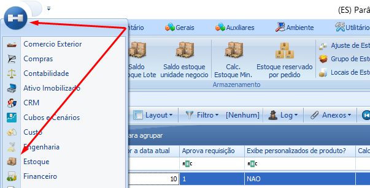
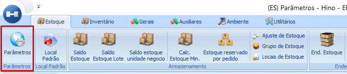
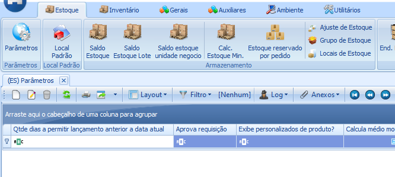
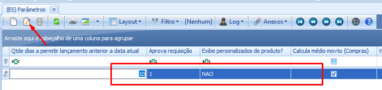
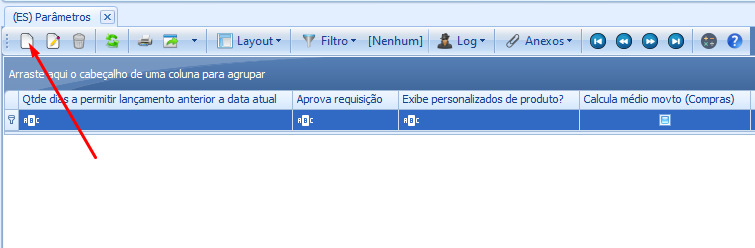
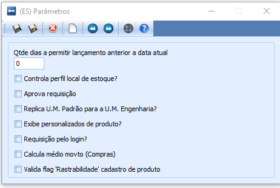
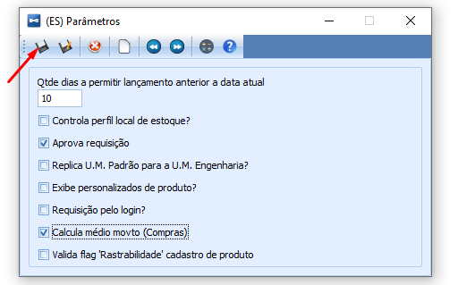

# Parâmetros

:::info
**Módulo**: Estoque

**Objetivo**: Definir os parâmetros do módulo de estoque
:::

:::danger
**Requisitos**

1. O usuário deve ter permissão para acessar o módulo de estoque
:::

:::tip
Quer aprender sobre permissões? [**Clique Aqui!**](../ambiente/configurar-permissoes.md)
:::

---

Os parâmetros de estoque não são definições complexas, mas sim configurações que determinam como o sistema deve processar os dados em resposta às ações dos colaboradores.

## Acessando os parâmetros

1. **Acesse o módulo de ‘Estoque’.**
- Clique no menu lateral esquerdo e em seguida clique em ‘Estoque’.

1. **Parâmetros**
- Dentro do módulo de ‘**Estoque**’, clique em no ícone ‘**Parâmetros**’

1. **Registro**
- Se for o primeiro acesso a esse módulo, não haverá  registro como pode ser visto na imagem abaixo.

- Se por algum motivo já existir o registro, basta selecionar o registro clicar em ‘**editar**’ para mudar os parâmetros.

- Se não houver o registro, clique em ‘**novo**’

:::warning
Em ambos os cenários, o resultado será o mesmo: você terá acesso ao registro dos parâmetros, o qual poderá ser editado ou criado. Entretanto, uma vez que o registro é criado, não é viável excluí-lo; somente é possível editá-lo. Além disso, não é permitido criar mais de um registro.
:::

---

1. **Entendendo os Parâmetros**
    

    
- **Qtde dias a permitir lançamento anterior a data atual**, você escolhe quantos dias o sistema deve permitir o movimento anterior a data que realmente está sendo realizado o movimento.
- **Controla perfil local de estoque?** Se marcado, os usuários só poderão ter acesso aos locais de estoque definido nas permissões.

:::tip
Quer aprender sobre permissões? [**Clique Aqui!**](../ambiente/configurar-permissoes.md)
:::

- **Aprova requisição.** Se marcado as requisições de estoque realizada pelos usuários serão aprovadas automaticamente sem a necessidade de uma aprovação manual.
- **Replica U.M. Padrão para a U.M. Engenharia?** Se marcado, o sistema vai considerar a unidade de medida padrão do produto para a unidade de medida utilizado pela engenharia.
- **Exibe personalizados de produto?** Se marcado, caso exista campos personalizados criados no cadastro de produto, esses campos serão mostrados na tela do saldo de estoque.

:::tip
Quer aprender sobre Campos Personalizados? [**Clique Aqui!**]()
:::

- **Requisição pelo login?** Se marcado, o usuário responsável por aprovar requisições precisa ter o cadastro de login associado ao cadastro de colaboradores

:::tip
Quer aprender sobre Cadastro de Colaboradores? [**Clique Aqui!**](../gerais/colaboradores.md)
:::

- **Calcula médio movto(Compras).** Se marcado essa opção vai fazer com que o sistema calcule o preço médio dos produtos a cada entrada de compra.
- **Valida flag ‘Rastreabilidade’ cadastro de produto.** Se marcado essa opção, o sistema vai validar se no cadastro do produto na aba ‘**PCP**’ está marcado ‘**Rastreabilidade**’. A rastreabilidade é responsável por gerar ‘**Lotes**’ para o produto e sendo assim o sistema irá validar se existem ‘**Lotes**’.

1. **Salvar os parâmetros criados**
- Após realizar as configurações desejadas, clique em salvar.

---