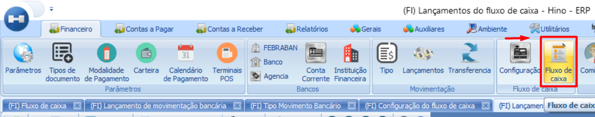
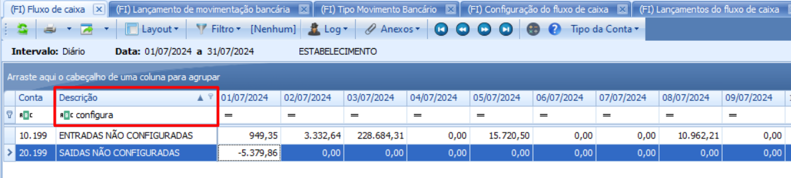
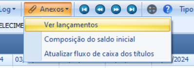
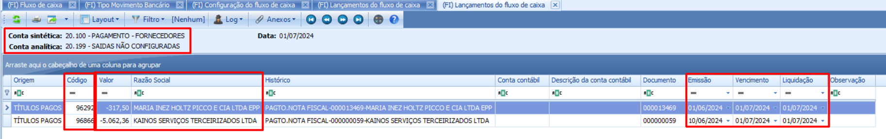

# Configuração Fluxo de Caixa - Entradas e Saídas Não Configuradas

:::info
**Modulo**: Financeiro

**Objetivo**: Capacitar o usuário para instruí-lo quanto às classificações dos produtos no ERP
:::

:::danger
**Requisitos:** 
Para executar o passo a passo do manual, você precisa ter em mãos os **títulos e as contas de fluxo** de caixa que serão referenciados.
:::

___

**Introdução:** 

Este documento tem como objetivo fornecer um guia detalhado para corrigir a situação de entradas e saídas que não possuem fluxo de caixa vinculado. 

O primeiro passo crucial na correção de entradas e saídas que não possuem fluxo de caixa vinculado é identificar quais títulos estão faltando essa vinculação no sistema

**Fluxo:** 

Hino → clique em financeiro → Clique em fluxo de caixa

→ No campo “Descrição” filtre “CONFIGURADAS” 

O sistema resultará os valores totais de entradas e saídas não configuradas 

Escolha uma das duas opções a seguir (entrada ou saída), começando pela que você deseja alterar primeiro.

Clique em anexos → ver lançamentos 

O sistema exibirá uma visão geral das entradas e saídas registradas. Nessa tela, são exibidos detalhes importantes como o título, o valor e a empresa a qual essas movimentações estão associadas.

Isso facilita a identificação das entradas e saídas, permitindo que você rapidamente localize cada transação e vá até o financeiro para incluir a conta de fluxo de caixa correta dentro do título.

💡 **Exemplo de saídas não configuradas exibidas na tela de lançamentos do fluxo de caixa:**

É importante você anotar as devidas informações 

**Código** (que corresponde ao código do título no financeiro) 

**Empresa** 

**Valor do titulo** 

**Para acerto das contas de fluxo de caixa de saída**: Consulte o manual específico para ajustes relacionados a saídas. Ele fornecerá o passo a passo para garantir que todos os detalhes estejam corretos e adequados.

[Configuração de fluxo de caixa para operações de saída (pagamentos)](fluxo-de-caixa-saidas.md)

- **Para acerto das contas de fluxo de caixa de entrada**: Consulte o manual destinado às entradas. Ele detalha os procedimentos para adicionar ou ajustar informações relacionadas às entradas no fluxo de caixa.

[Configuração de fluxo de caixa para operações de entrada (recebimento)](fluxo-de-caixa-recebimentos.md)

---