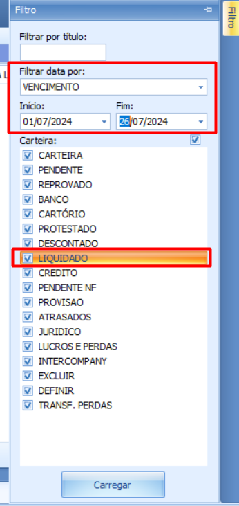
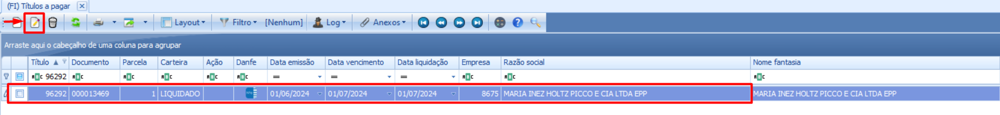
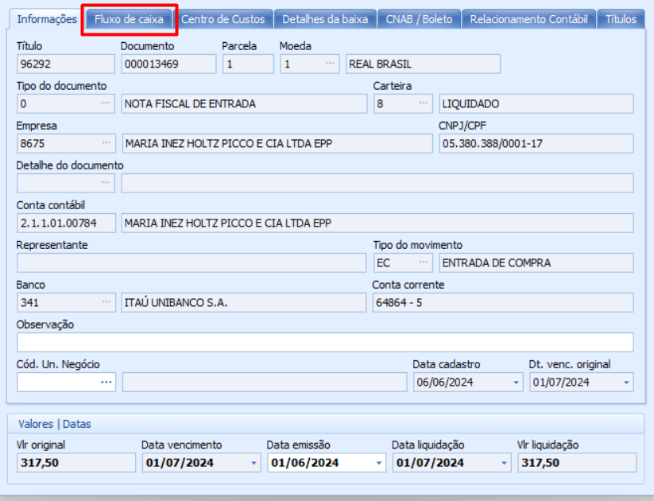
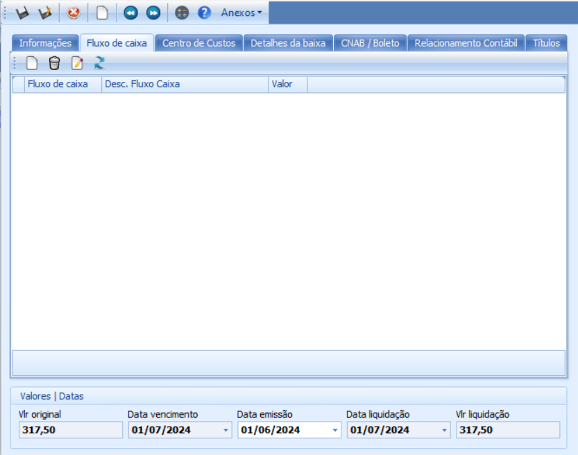
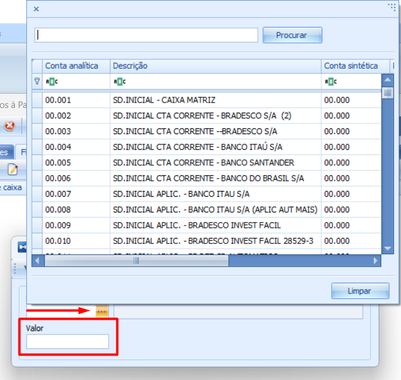
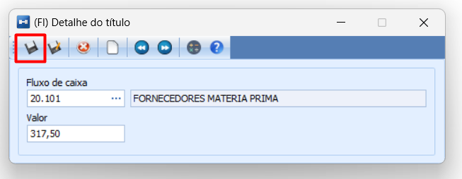
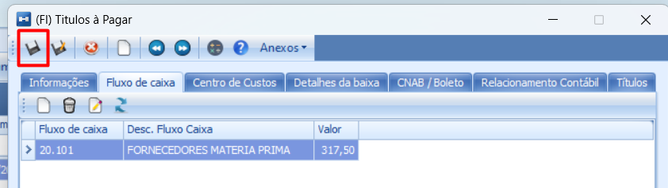

# Configuração de fluxo de caixa para operações de saída (pagamentos)

:::info
**Modulo**: Financeiro

**Objetivo**: Capacitar o usuário para instruí-lo quanto às classificações dos produtos no ERP
:::

:::danger
**Requisitos:** 
Para executar o passo a passo do manual, você precisa ter em mãos os **títulos e as contas de fluxo** de caixa que serão referenciados.
:::

___

Hino → Contas a pagar → Filtro 

:::warning
📢 **Atenção aos detalhes:**
Verifique se o título que deseja alterar está dentro do período definido no filtro e se a carteira liquidada está selecionada.
:::

Localize o titulo 

Você pode utilizar o código do título copiado ao pesquisar nas movimentações sem configurações, facilitando a localização do título no sistema. Alternativamente, você pode pesquisar por fornecedor, valor, nota fiscal (NF) ou outros critérios relevantes para encontrar o título desejado mais rapidamente.
 
Selecione o título e clique em editar 

O sistema exibirá uma tela detalhada com todas as informações relevantes para o título selecionado

Clique na sub aba “Fluxo de caixa” 

O sistema exibirá uma tela sem nenhuma conta de fluxo de caixa informada. É neste ponto que devemos fazer a alteração para a conta de fluxo de caixa correspondente.

Clique em “novo” 

Clique nos três pontos e selecione a conta analítica de fluxo de caixa que faz referência a esse titulo

No campo valor, informe o valor do título 

Clique em salvar 

Clique em salvar novamente 

