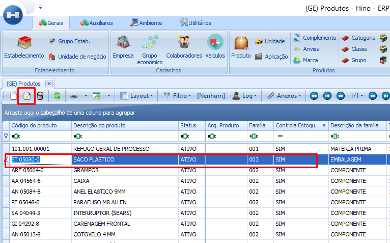
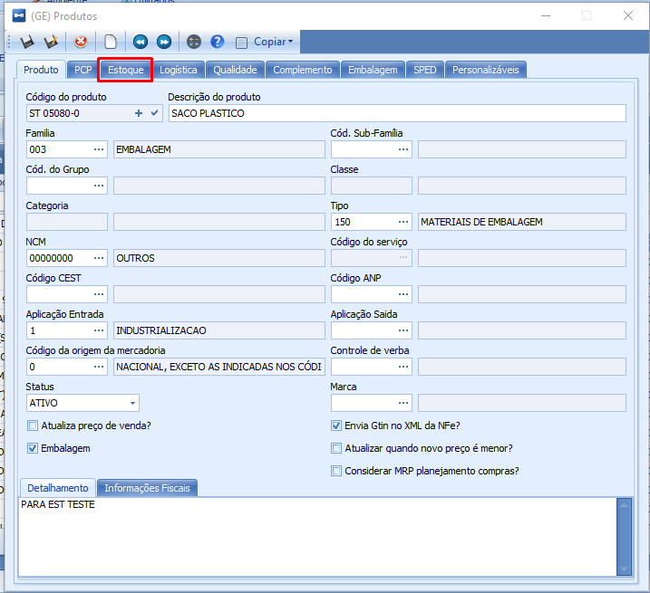
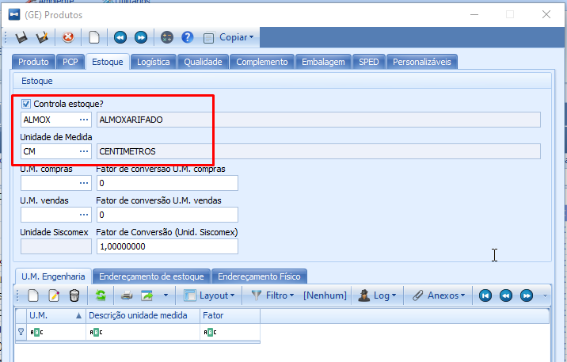
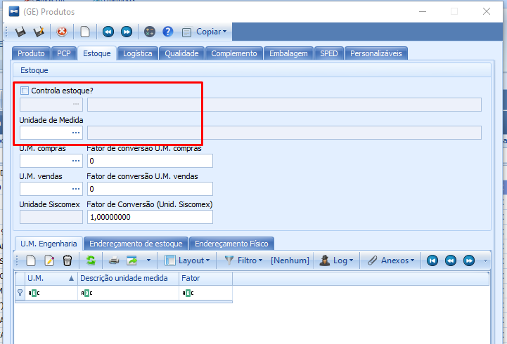
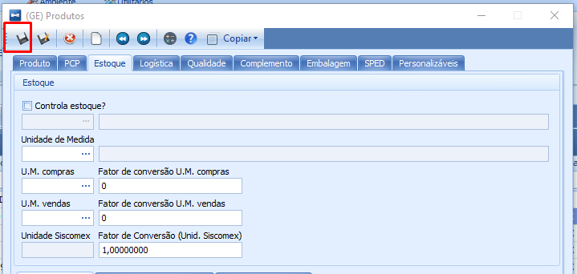

import ReactPlayer from 'react-player'

# Produto e Controle de Estoque

:::info
**Modulo**: Gerais

**Objetivo**: Definir se um produto controla ou não estoque
:::

---

## Como Verificar se um Produto Controla Estoque?

Ao acessar Gerais → Produtos, no grid principal é possível verificar e também filtrar pelos produtos que controlam e não controlam estoque

<ReactPlayer controls url='/videos/gerais/cadastro-produto-controle-estoque.mp4'/>

## Como Definir se um Produto Controla Estoque?

Para realizar a mudança, selecione o produto desejado e clique em editar. 

Ao clicar em editar como no exemplo acima, a tela com os dados do produto selecionado será aberta. Clique então sobre a aba ‘Estoque’.

A caixa de seleção Controla estoque? - Se marcada o produto está controlando estoque e a unidade de medida do produto está logo abaixo, ao definir que um produto controla estoque é preciso dizer qual o local de estoque padrão ou seja quando entra saldo desse produto qual o local de estoque padrão? | No exemplo abaixo temos ‘Almoxarifado’ como local padrão.

Agora se a caixa de seleção estiver desmarcada, significa que o produto não controla estoque.

Após realizar essa definição clique em salvar.

**Esse tipo de revisão e manutenção deve ser comum entre os cadastros para garantir que os produtos estejam cadastrados corretamente.**

<ReactPlayer playing controls url='/videos/estoque/cadastro-produto-controle-estoque-1.mp4'/>

---