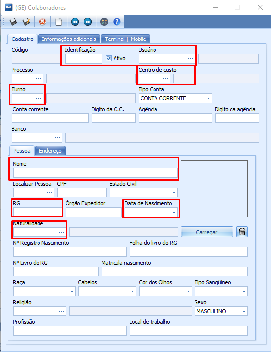

# Colaboradores

:::info
**Modulo**: Gerais

**Objetivo**: Capacitar o usuário para realizar o cadastro de colaboradores no ERP
:::

:::danger
**Requisitos**: 

O usuário responsável pelo cadastro dos colaboradores deve estar cadastrado no ERP em posse de seu nome de usuário, senha e estar com as devidas permissões para acesso ao modulo.
:::

:::tip
Quer aprender sobre o Permissões ? [**Clique Aqui!**](https://www.notion.so/Permiss-es-8656d4b6d744403a8fd678f898ea2f74?pvs=21)
:::

---

## Como cadastrar colaboradores

- Na aba ‘Gerais’, clique em colaboradores

- Clique em ‘Novo’ para iniciar um novo cadastro

- Na tela (GE) Colaboradores na aba ‘**Cadastro**’ destacaremos em vermelho as informações principais a serem preenchidas, muitas das informações não precisam de explicações sobre, pois o próprio nome do campo já diz.

Preencha as informações destacadas ↓

O campo **Identificação** é para preencher com o número do crachá do colaborador, também pode ser atribuido nesse campo o número do registro no ESOCIAL ou do número de registro atribuído no momento da contratação.

O campo **Usuário** é para vincular o usuário do colaborador caso ele seja utilizador do ERP e tenha usuário cadastrado.

:::tip
Quer aprender sobre os Usuários ? [**Clique Aqui!**](https://www.notion.so/Cria-o-de-Usu-rios-para-o-ERP-5e14acced9604d91b8f8c69f85154cb5?pvs=21)
:::

O campo **Centro de Custo** é para vincular o centro de custo a qual o colaborador pertence. É importante esse vínculo para contribuir no fechamento de custo da empresa, sem isso não é possível saber quanto o colaborador está custando para a empresa.

:::tip
Quer aprender como cadastrar centro de custos ? **Clique Aqui!**
:::

O campo **Turno** é para vincular o turno de trabalho do colaborador, isso é importante pois em algumas tarefas o ERP registra o tudo no colaborador.

:::tip
Quer aprender como cadastrar Turnos ? **Clique Aqui!**
:::

Os campos; **Nome, RG, Data de Nascimento** e **Naturalidade**, são dados essênciais para a identificação do colaborador que está sendo cadastrado.

---

- Na tela (GE) Colaboradores na aba ‘**Terminal | Mobile**’ marque as opções desejadas caso o colaborador seja utilizador do aplicativo Hino Estoque

Não marque a opção ‘**Aponta Mobile**’ e não clique no botão ‘**Gerar senha**’ pois atualmente o ERP utiliza outros dados do colaborador para realizar o login no aplicativo e não possui campo para inserir senha.

- Os demais campos nas abas do cadastro de colaboradores são informativos e opcionais, possibilitando enriquecer o cadastro do colaborador.

---

- Após preencher todos os campos desejados, clique em **salvar**.

Caso queira editar um cadastro já existente, basta clicar no registro deseja e em seguida clicar em **editar**

