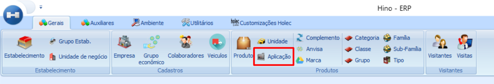
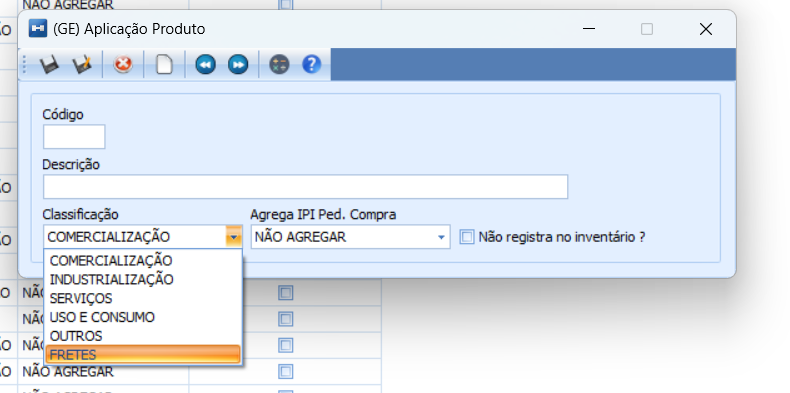

# Cadastro Aplicação de Produto

:::info
**Modulo**: Gerais

**Objetivo**: Capacitar o usuário para instruí-lo quanto às classificações dos produtos no ERP.
:::

---

Na aba gerais clique em aplicação.

A tela de aplicação de produto será iniciada e as aplicações de produto já existentes serão exibidas. 

:::note
💡 Recomendação: Role a tela até a última aplicação e veja qual é o último número da sequência, para que você possa criar a próxima seguindo a sequência corretamente.
:::

Clique em novo → a tela de cadastro será iniciada, entenda abaixo como preencher os campos.

## Instruções para Preenchimento dos Campos

**Código:** Essa informação é você quem coloca. Recomendamos colocar o próximo número sequencial. 
**Descrição:** A descrição deve ser clara para que todos internamente saibam a que tipo de aplicação ela se refere. 
**Classificação:** Para qual finalidade o produto será utilizado.
**Agrega IPI Ped. Compra:** Caso agregue você deve clicar na seta e selecionar a opção que se encaixa.
**Não Registra no Inventário?** Caso a aplicação criada seja para produtos que não terão registro no inventário você deve seleciona-la.

Clique em salvar.

---