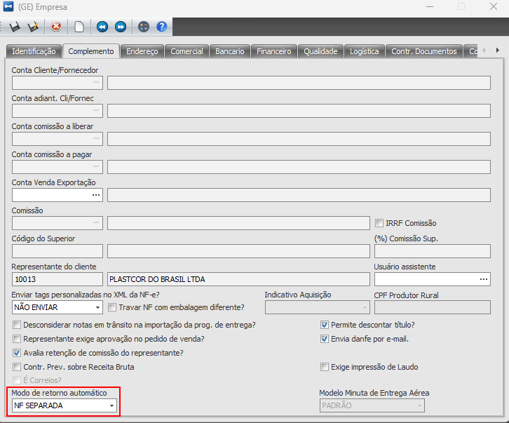

# Modo Retorno Automático

:::info
**Módulo:** Gerais

**Objetivo:** Configurar empresas para a realização do retorno automático.
:::

---

Foi criada uma nova funcionalidade para separar os itens de retorno em uma outra nota fiscal. Para habilitar essa funcionalidade, além de ter configurado a natureza de operação para gerar o retorno automático, deve-se marcar na empresa, na aba "Complemento", no campo "Modo de retorno automático" a opção "NF Separada".

Na emissão da NF, a única diferença é que antes o sistema já incluía os itens de retorno ao selecionar o item faturado. Agora, após adicionar os itens faturados e salvar a nota fiscal, e o sistema irá gerar a outra nota.

---