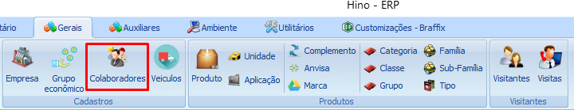
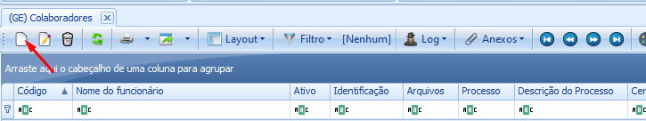
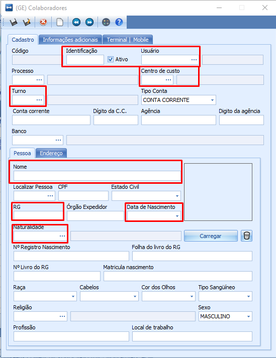

import ReactPlayer from 'react-player'

# Estabelecimento

:::info
**Módulo:** Gerais

**Objetivo:** Manter as informações da empresa atualizadas
:::

:::danger
**Requisitos**: 

1. O estabelecimento é por padrão criado ao realizar o contrato com Hino Sistemas
:::

___

## Quais tarefas podem ser realizadas em ‘Estabelecimento’ ?

Como as informações básicas serão carregadas de maneira automática devido ao CNPJ, as tarefas que podem ser realizadas são; revisão, alteração e inclusão das informações.

1 - Clique em Estabelecimento

2 - Selecione o registro do estabelecimento desejado clicando sobre o mesmo, e clique em editar

3 - Navegue entre as abas superiores e realize a alteração nos dados desejados ou a inclusão  de dados adicionais. 

<ReactPlayer controls url='/videos/gerais/estabelecimentos.mp4'/>

Após realizar as alterações desejadas clique em Salvar

As abas ‘Parametros (Terceiro) e (AMAZON) são para uso do HINO, por tanto não mexa nesses parâmetros.

:::tip
Quer aprender sobre grupo de estabelecimentos? [**Clique aqui**](grupo-estabelecimentos.md).

Quer aprender sobre unidades de negócio? [**Clique aqui**](unidade-de-negocio.md).
:::