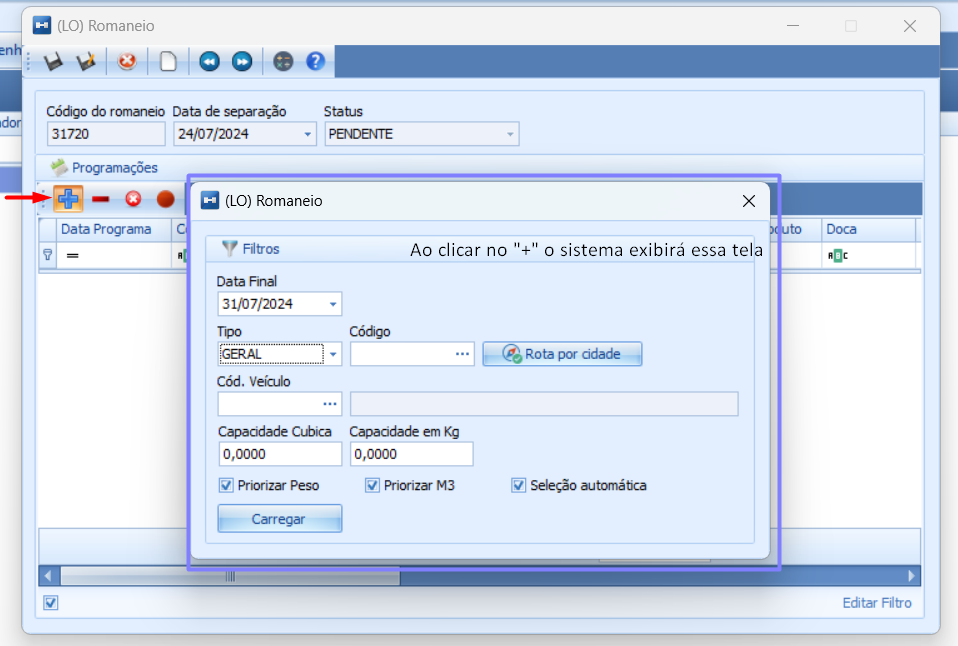
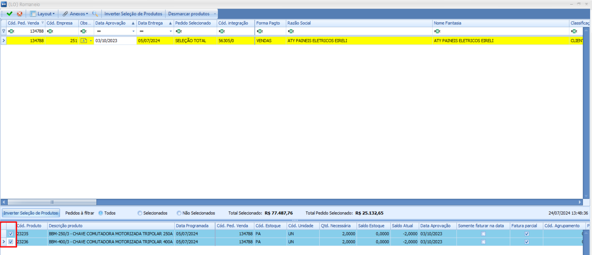
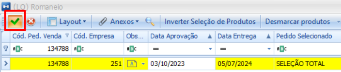
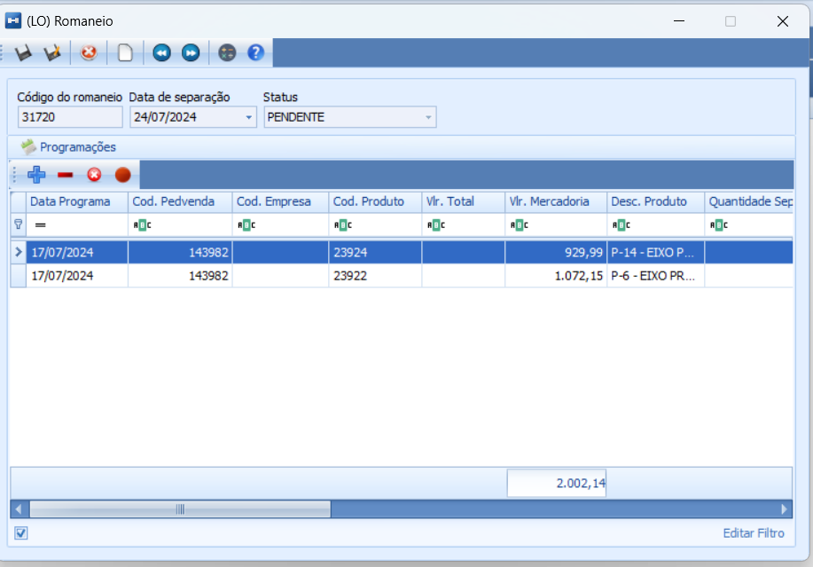
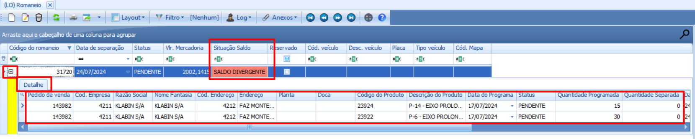

# Emissão de Romaneio

:::info
**Modulo**: Logística

**Objetivo**: Capacitar o usuário para instruí-lo quanto às classificações dos produtos no ERP
:::

___

O romaneio é um documento fundamental para empresas que realizam operações logísticas e gestão de estoque. Sua principal função é detalhar a lista de itens que serão separados e enviados em um pedido.

**Fluxo:** Clique em Menu → Logística → Romaneio 

Clique em novo(F2)  

Clique no botão “+” 

A tela inicial do romaneio será exibida. É nesta tela que iremos informar quais pedidos farão parte deste romaneio. 

Informe a “Data Final” 

O campo “data final” é utilizado para mostrar ao sistema qual deve ser a última data de programação que ele deve considerar.  

Então, por exemplo, se um pedido está programado para o dia 30/08/2024 e você preenche uma data anterior a essa, o sistema não conseguirá localizar os itens do pedido a ser separado.

Em “TIPO” você deve informar a maneira que você quer pesquisar os itens a serem incluídos no romaneio, deixarei um explicativo →  

[Explicativo campo “Tipo” no módulo Logística ](tipo-de-romaneio.md)

Clique em Carregar 

O sistema exibirá todos os pedidos aprovados → Selecione os que você emitira o romaneio 

(Neste exemplo, utilizei o campo “Tipo” como “Pedido” para que o sistema filtre e exiba somente os pedidos que serão utilizados para a emissão do romaneio.)

Clique no sinal de “positivo”  

O sistema retornará à tela inicial com os itens selecionados de acordo com a programação informada.

Clique em salvar (F10) 

O sistema exibirá o romaneio de forma simplificada e informará a situação do saldo de estoque em relação à separação dos produtos do pedido. 

---