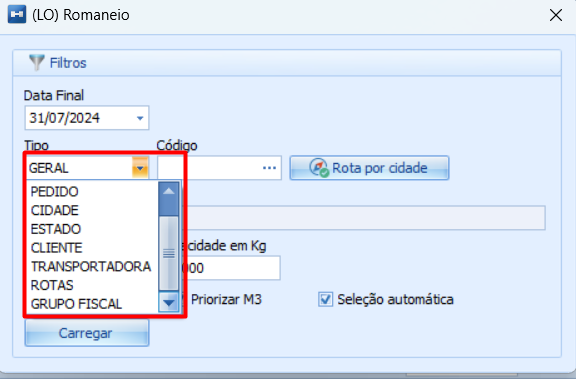

# Tipos de Separação

:::info
**Modulo**: Logística

**Objetivo**: Capacitar o usuário para instruí-lo quanto às classificações dos produtos no ERP
:::

___

Este documento fornece uma explicação detalhada sobre as opções de filtro disponíveis ao selecionar o campo “Tipo” na emissão de um romaneio.

**Geral:** O sistema irá buscar e exibir todos os itens dos pedidos aprovados, independentemente de terem transportadora associada ou de estarem em localizações diferentes.

**Pedido:** O sistema solicitará que você informe o número do pedido de venda no campo “Código”. Dessa forma, ao clicar em "Carregar", ele exibirá apenas os itens do pedido mencionado.

**Cidade ou Estado:** O sistema solicitará que você informe uma cidade ou um estado. Ele exibirá apenas os itens dos pedidos destinados a essa cidade ou estado.

**Cliente:** Da mesma forma, se você selecionar a opção de cliente, o sistema pedirá que você informe o cadastro do cliente e exibirá apenas os pedidos desse cliente.

**Transportadora:** Se você escolher a opção de transportadora, o sistema solicitará que você informe o código da transportadora e exibirá apenas os pedidos associados a essa transportadora.

**Rota:** Ao selecionar a opção de rota, o sistema pedirá que você informe o código da rota e exibirá apenas os itens dos pedidos que pertencem a essa rota.

**Grupo Fiscal:** Da mesma forma, se você selecionar a opção de grupo fiscal, o sistema solicitará que você informe o grupo fiscal e exibirá apenas os itens dos pedidos pertencentes a esse grupo.

---