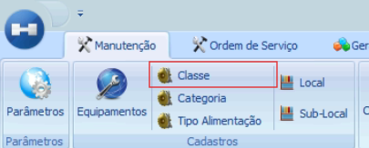
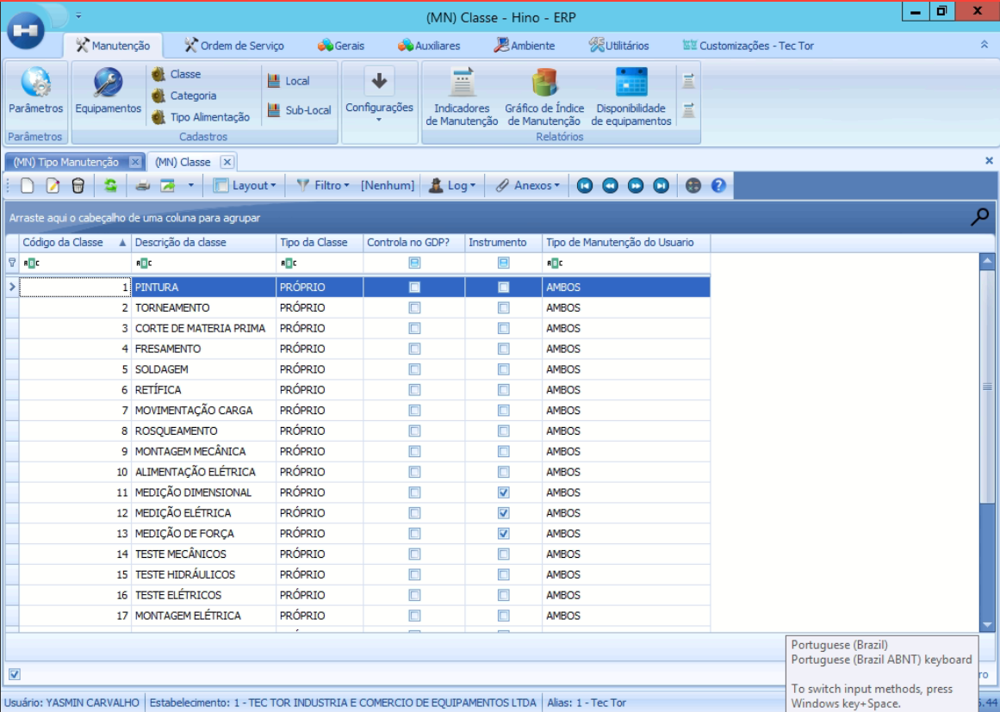
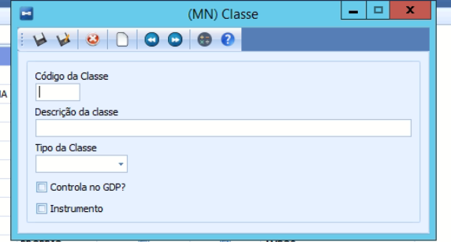
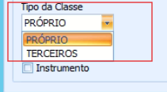

# Classe de Equipamento

:::info
**Modulo**: Manutenção

**Objetivo**: Capacitar o usuário para instruí-lo quanto às classificações dos produtos no ERP
:::

___

Introdução: Dentro de um sistema ERP, as classes de equipamentos desempenham um papel fundamental na organização e gestão dos ativos de uma empresa. Elas categorizam os diferentes tipos de equipamentos com base em suas características específicas, permitindo uma melhor organização, manutenção eficiente e análise de desempenho. Essa estrutura não apenas facilita o controle de custos e a gestão de recursos, mas também ajuda na tomada de decisões estratégicas para o planejamento de capacidade e otimização das operações.

Como consultar ou criar uma classe de equipamento? Veja:

Clique em Hino >> Manutenção 

Clique em Classe

Você irá verificar as classes de equipamentos já cadastradas (se houver).

- Caso você não utilize essa função e queira começar, para criar uma do zero siga os passos:

Clique em novo 

Nessa aba, você fará o cadastro da classe de um equipamento, preenchendo conforme os parâmetros da sua empresa.

- Código da Classe e Descrição da Classe

(preencher de acordo com os parâmetros da sua empresa)

- Tipo da Classe

PRÓPRIO: refere-se a equipamentos que pertencem à empresa.

TERCEIROS: refere-se a equipamentos que são de propriedade de terceiros, ou seja, de uma entidade externa à empresa. 

**Controla GDP?** (GDP é a abreviação de "Geração de Documento de Produção" é um termo utilizado para descrever o processo do sistema onde serão gerados documentos relacionados à produção, tais como ordens de produção e relatórios de produção.

Clique em salvar (F10)