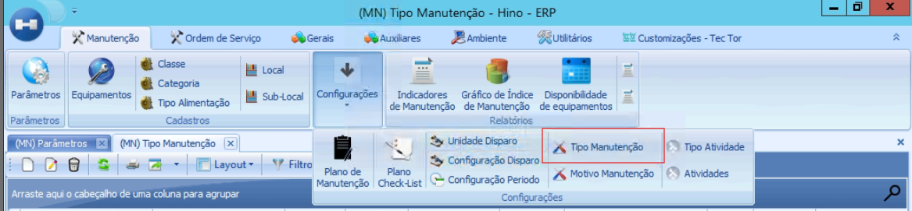
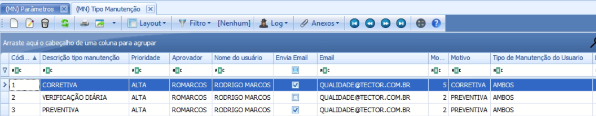
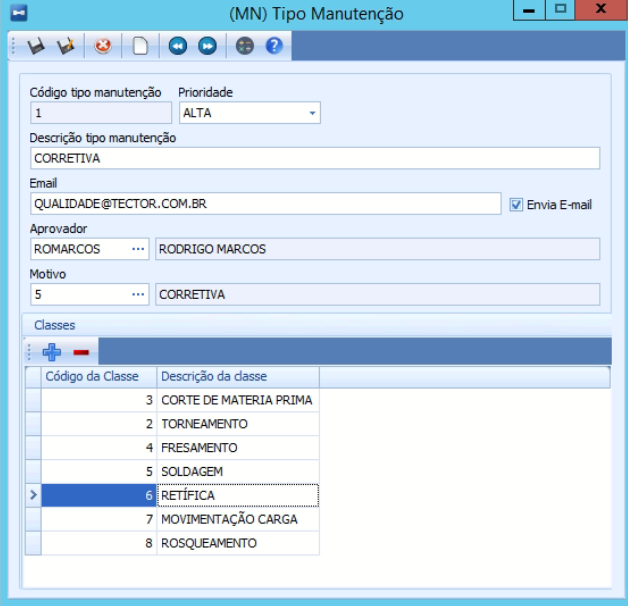
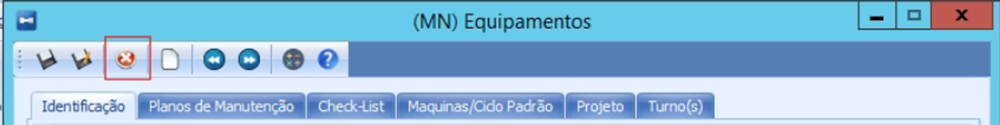

# Como consultar os e-mails e classes vinculados aos tipos de manutenção

:::info
**Modulo**: Manutenção

**Objetivo**: Capacitar o usuário para instruí-lo quanto às classificações dos produtos no ERP
:::

Clique em Menu 

Clique em Manutenção 

Clique em Tipo Manutenção

Nessa aba, podemos verificar quais tipos de manutenção enviam e-mails para pessoas específicas. Ao selecionar cada tipo individualmente e clicar em "Editar", podemos ver quais classes de equipamentos estão sendo abrangidas por cada tipo de manutenção.

Selecione o tipo de manutenção que você estará utilizando na solicitação de O.S.

Clique em editar 

Nessa aba, você poderá visualizar o e-mail que está sendo utilizado e as classes de equipamentos que esse tipo de manutenção abrange para o envio de e-mail. 

Caso a classe do seu equipamento já esteja vinculada ao tipo de manutenção, você pode fechar essa aba clicando no “X” 

:::tip
Precisa incluir a classe do equipamento no tipo de manutenção? Clique aqui
[Como vincular a classe de um equipamento em um tipo de manutenção ](https://www.notion.so/Como-vincular-a-classe-de-um-equipamento-em-um-tipo-de-manuten-o-a08914a21f144cbd803fa51ccabc3bc2?pvs=21)
:::