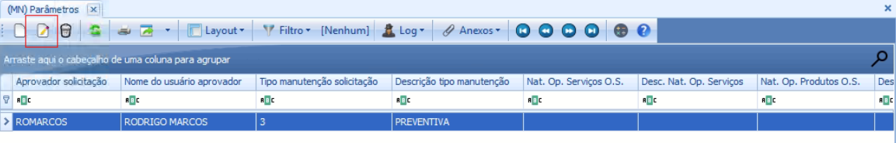
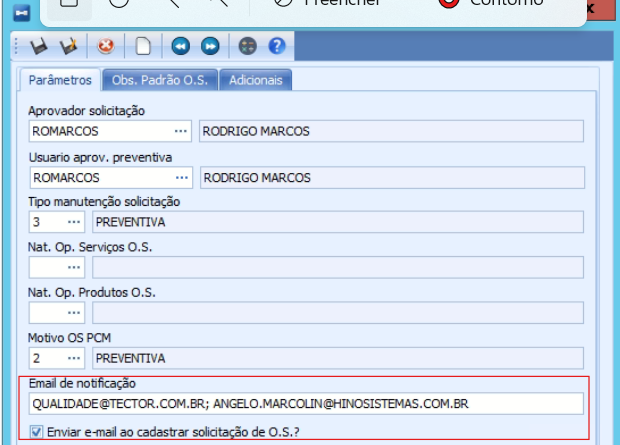
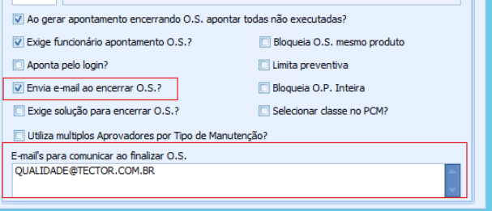

# Como incluir|consultar o e-mail cadastrado no parâmetro

👉 Clique em Menu 

👉 Clique em Manutenção 

**ENTRADA 1:**  Clique em Parâmetros 

O e-mail informado nos parâmetros é padrão. Se não houver nenhum outro vínculo ou subdivisão que estabeleça critérios específicos para o envio de e-mails de ordens de serviço, o sistema utilizará esse e-mail padrão

👉 Selecione o parâmetro e clique em editar 

**1 Verificação:**

📝Confira se o campo "e-mail de notificação" está preenchido e se a opção "ENVIAR E-MAIL AO CADASTRAR SOLICITAÇÃO DE O.S" está habilitada.

👉 Se não estiverem preenchidos ou habilitados, você deve completar as informações necessárias e ativar a opção "ENVIAR E-MAIL AO CADASTRAR SOLICITAÇÃO DE O.S".

**2° Verificação:**

📝Confira se o campo "e-mail para comunicar ao finalizar O.S.” está preenchido e se a opção "ENVIAR E-MAIL AO ENCERRAR DE O.S" está habilitada.

👉 Se não estiverem preenchidos ou habilitados, você deve completar as informações necessárias e ativar a opção "ENVIAR E-MAIL AO CADASTRAR SOLICITAÇÃO DE O.S".

Clique em salvar (F10)