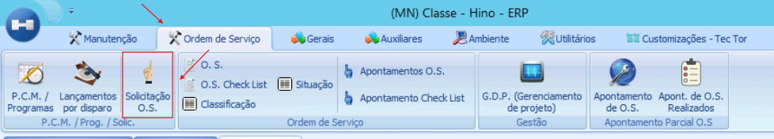
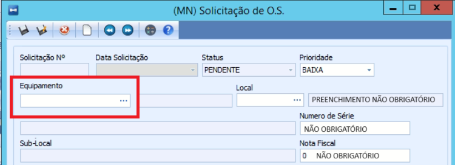
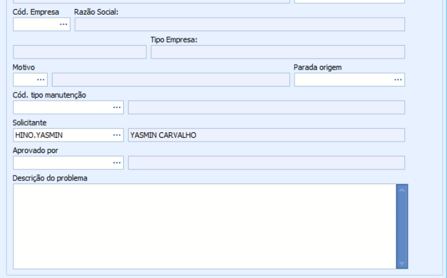
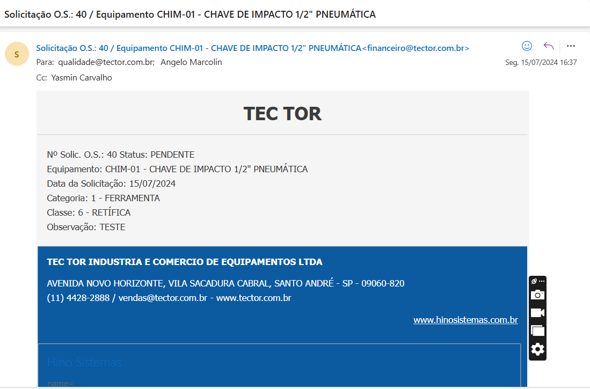
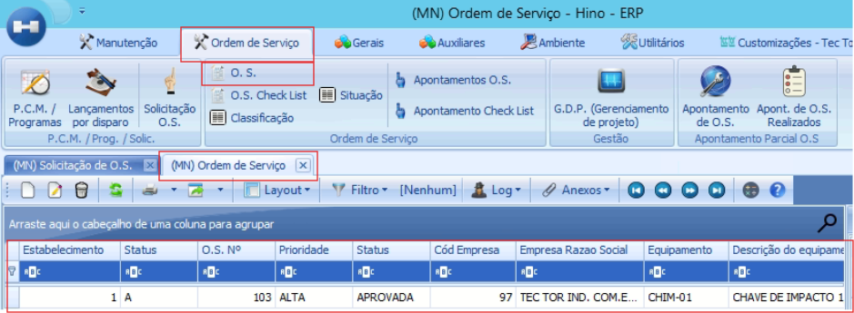

# Solicitação de Ordem de Serviço

:::info
**Modulo**: Manutenção

**Objetivo**: Capacitar o usuário para instruí-lo quanto às classificações dos produtos no ERP
:::

:::danger
**Requisitos** 

Classe do equipamento o qual você irá abrir a solicitação

:::tip
[Como consultar a classe de um equipamento](https://www.notion.so/Como-consultar-a-classe-de-um-equipamento-2117ef32daf9403393599ded4d1ce952?pvs=21)
:::

Verifique se a classe do equipamento está informada no tipo de manutenção para o qual você está solicitando a ordem de serviço, e confira se o e-mail do responsável está vinculado a essa classe.

:::tip
[Como incluir|consultar o e-mail cadastrado no parâmetro](https://www.notion.so/Como-incluir-consultar-o-e-mail-cadastrado-no-par-metro-762ae2bb68aa4db7b4c88f22a9b02643?pvs=21)
:::

:::tip
[Como consultar os e-mails e classes vinculados aos tipos de manutenção](https://www.notion.so/Como-consultar-os-e-mails-e-classes-vinculados-aos-tipos-de-manuten-o-d873ed7a439840a6ad6bd2253c006797?pvs=21)
:::

:::tip
[Como vincular a classe de um equipamento em um tipo de manutenção ](https://www.notion.so/Como-vincular-a-classe-de-um-equipamento-em-um-tipo-de-manuten-o-a08914a21f144cbd803fa51ccabc3bc2?pvs=21)
:::
:::

---

Durante nossa revisão dos parâmetros do módulo de manutenção, identificamos um problema relacionado ao envio de e-mails automáticos. Ao abrir uma solicitação de ordem de produção, ao aprova-la o sistema não estava disparando o e-mail automaticamente como esperado, embora os e-mails estivessem configurados corretamente para cada tipo de manutenção. 

**INTRODUÇÃO:**
No módulo de manutenção do sistema, quando apenas um e-mail está vinculado aos parâmetros, todas as ordens de produção geradas enviarão notificações para esse e-mail. No entanto, se a empresa desejar enviar e-mails para responsáveis diferentes, conforme o tipo de manutenção, é essencial vincular cada tipo de manutenção ao e-mail correspondente do responsável. Além disso, ao utilizar essa função, é necessário também vincular as classes de equipamentos. Sem as classes cadastradas para o tipo de manutenção específico, o sistema não enviará e-mails automaticamente

Clique em Hino

Clique em Manutenção >> Ordem de Serviço

 

O sistema iniciara a solicitação de ordem de serviço 

Em "Equipamento", você deve especificar qual equipamento necessita de manutenção ou reparo.

**Os outros campos devem ser preenchidos conforme os motivos que justificam a abertura da solicitação de ordem de serviço.**

:::warning
📢 **NÃO ESQUEÇA:**  é crucial preencher o campo "Descrição do Problema" para que o aprovador compreenda o motivo pelo qual o equipamento precisa de manutenção ou reparo.
:::

Clique em salvar (F10) 

Clique em anexo >> Aprovar solicitação 

O sistema irá automaticamente disparar um e-mail para o responsável que estiver vinculado aos parâmetros e gerar uma ordem de serviço.

>> E-mail 

>> Ordem de serviço 

(Caminho: Hino >> Manutenção >> Ordem de serviço >> O.S.) 

