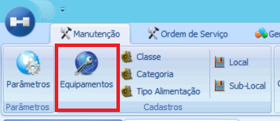
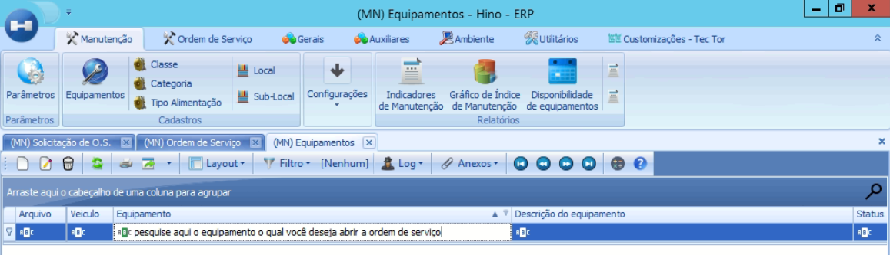
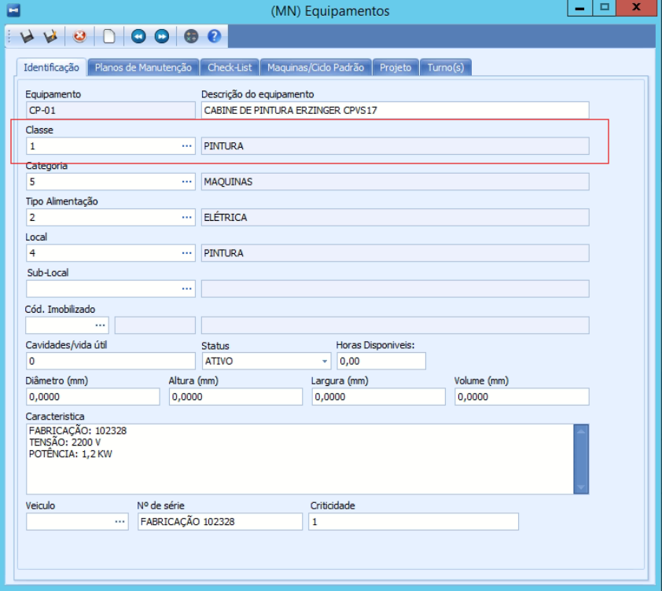
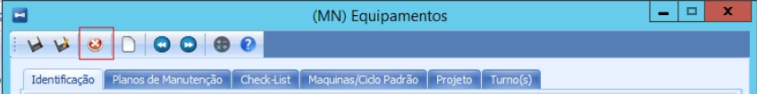

# Classe de Equipamento

:::info
**Modulo**: Manutenção

**Objetivo**: Capacitar o usuário para instruí-lo quanto às classificações dos produtos no ERP
:::

Clique em Menu 

Clique em Manutenção 

Clique em Equipamentos 

O sistema exibirá todos os equipamentos cadastrados. Utilize a coluna "Equipamento" para pesquisar e selecionar o equipamento para o qual você verificará a classe antes de abrir a solicitação de ordem de serviço.

Selecione o equipamento e clique em editar 

O sistema mostrará a ficha geral do equipamento, onde você precisará verificar o número e a descrição da classe à qual ele pertence.

Anote a classe do equipamento e feche a aba clicando no “x” 

---