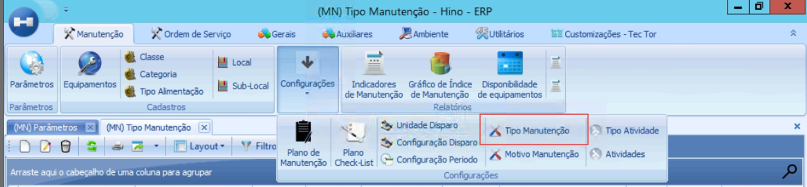
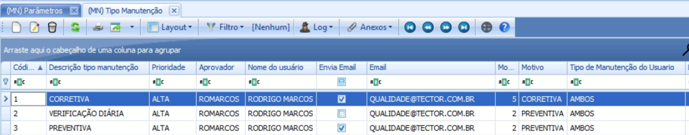
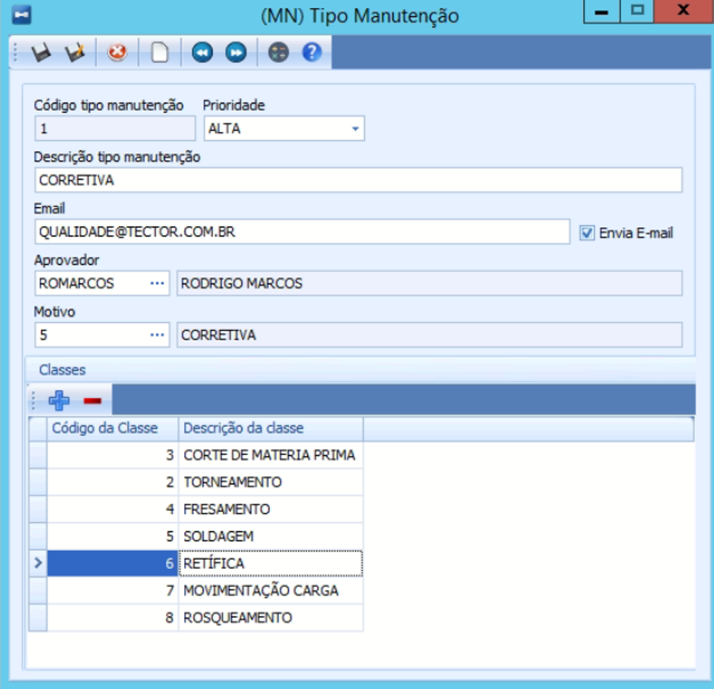
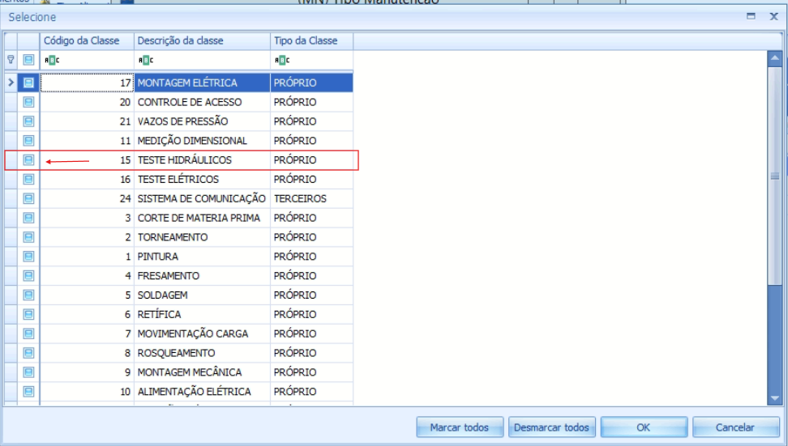
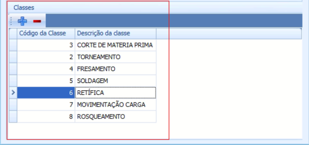

# Vincular Classe de Equipamento em Tipo de Manutenção

:::info
**Modulo**: Manutenção

**Objetivo**: Capacitar o usuário para instruí-lo quanto às classificações dos produtos no ERP
:::

---

Clique em Menu.

Clique em Manutenção.

Clique em Tipo Manutenção.

Nessa aba, podemos verificar quais tipos de manutenção enviam e-mails para pessoas específicas. Ao selecionar cada tipo individualmente e clicar em "Editar", podemos ver quais classes de equipamentos estão sendo abrangidas por cada tipo de manutenção.

Selecione o tipo de manutenção ao qual você deseja adicionar a classe de equipamento. 

Clique em editar (usarei nesse manual como exemplo o tipo de manutenção 1 - CORRETIVA).

Nessa aba, você poderá visualizar as classes de equipamentos que esse tipo de manutenção abrange, para acrescentar uma nova classe: 

Clique no sinal de “+”.

Selecione a classe clicando na caixinha.

Clique em “OK” no canto inferior da tela.

A tela será atualizada e retornará com a nova classe de equipamento incluída nessa lista.

Finalize as alterações clicando em salvar F(10).

---