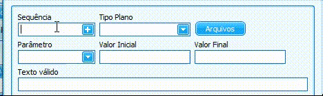

# Inspeção de Qualidade

### Criando o plano de inspeção

:::info
**Modulo**: Produção

**Objetivo**: Realizar o apontamento de produção através do terminal
:::

:::danger
**Requisitos**

1. O produto deve ter rastreabilidade marcada (Lote)
:::

O plano de inspeção é criado no módulo de qualidade. Nessa aba, temos as opções de criar os planos de RECEBIMENTO, TERCEIRO, PRODUÇÃO, PRODUÇÃO POR ROTINA, PRODUÇÃO POR OPERAÇÃO, RECEBIMENTO 200% e PRODUÇÃO 200%.

Na aba ‘Plano de Inspeção’ clique em novo.

Ao clicar em novo será aberta uma nova tela.

**Classificação:** É onde você escolhe qual TIPO DE PLANO você vai criar.

Escolha a classificação, preencha os dados e clique em **salvar e editar.**

**CONTROLE PRODUTO:** Realiza a inspeção por produto acabado.

**CONTROLE ROTINA:** Controla a inspeção a cada rotina de produção.

**CONTROLE OPERAÇÃO:** Controla a inspeção por operação.

**PRODUTOS VINCULADOS:** Apenas informativo de quais produtos utiliza o mesmo plano de inspeção.

**DESENHO OP:** Para guardar um desenho da ordem de produção para o produto.

**DESENHO PLANO INSP:** Caso exista um desenho para o plano de inspeção.

**COPIAR PLANO:** Realiza cópia de um plano já criado, para outros produtos.

**PRODUTO ACABADO:** Apenas informativo sobre qual acabado está sendo inspecionado **Não obrigatório**

**PRODUTO [X] INSPECIONA:** O produto que realmente vai ser inspecionado. **Obrigatório**

**CADASTRO:** É a data que está sendo cadastrado a inspeção. **Automático**

**VIGÊNCIA:** É a data que começa a valer a inspeção. **Obrigatório**

**DATA CONFERIDO:** É a mesma data de cadastro, mas também caso aconteça uma revisão no plano essa vai ser a data do conferido. **Obrigatório caso seja feita uma revisão**

**DATA DESENHO:** Se houver um desenho atrelado ao plano de inspeção, qual foi a data desse desenho? **Não Obrigatório**

**REVISÃO:** É a data de revisão do desenho caso tenha. **Não Obrigatório**

**PLANO DE REAÇÃO:** No caso de uma não conformidade qual é o plano de reação? **Não Obrigatório**

Ao clicar em **Salvar e Editar** outras abas serão abertas.

Escolha o modo de inspeção (Controle de Produto, Rotina etc…) e clique em **NOVO** selecione o **PRODUTO**, definina a **VIGÊNCIA** e depois **SALVAR E EDITAR** para liberar as outras **ABAS**.

Como exemplo estou criando a inspeção para o **CONTROLE PRODUTOS.** 

Na **ABA CONTROLE PRODUTOS**  clique em **NOVO**.

**Sequência:** É a sequência de inspeção, por padrão o sistema cria de 10 em 10 mas pode ser adicionado manualmente.

**Tipo Plano:**  Escolhe se o plano da inspeção é do tipo: **Dimensional**, **Texto** ou **Verdadeiro ou Falso**.

**Valor Inicial e Valor Final:** É o Mínimo e Máximo a ser definido quando o plano for **DIMENSIONAL**

**Parâmetro:** É qual parâmetro vai ser considerado inspecionar em um plano DIMENSIONAL se é média ou intervalo.

**Texto Válido:** Quando o tipo do plano for TEXTO, qual texto deve ser válido? Por exemplo para a inspeção do padrão ASPECTO E COR | TEXTO VÁLIDO

**Verdadeiro ou Falso:** Defina qual resposta é verdadeira e falsa em **AMOSTRA|MÉTODO**

Considerando uma inspeção real abaixo.

Uma sequência de inspeção **DIMENSIONAL** ficará então da seguinte maneira.

Uma sequência de inspeção **VERDADEIRO OU FALSO**  ficará então da seguinte maneira.

# Visualizando o plano de inspeção

Ao criar todas as sequências **DIMENSIONAIS** e **VERDADEIRO OU FALSO**, nosso plano ficará da seguinte maneira.

# Aprovando plano de inspeção

A única coisa que falta agora é aprovar o plano. Para isso vamos em anexo, aprovar.

# Considerações finais

Um plano de inspeção pode ser utilizado para facilitar a criação de outros planos, restando apenas a edição dos parâmetros. Fica a critério do responsável sobre quais tipos de planos utilizar e qual tipo de plano utilizar.