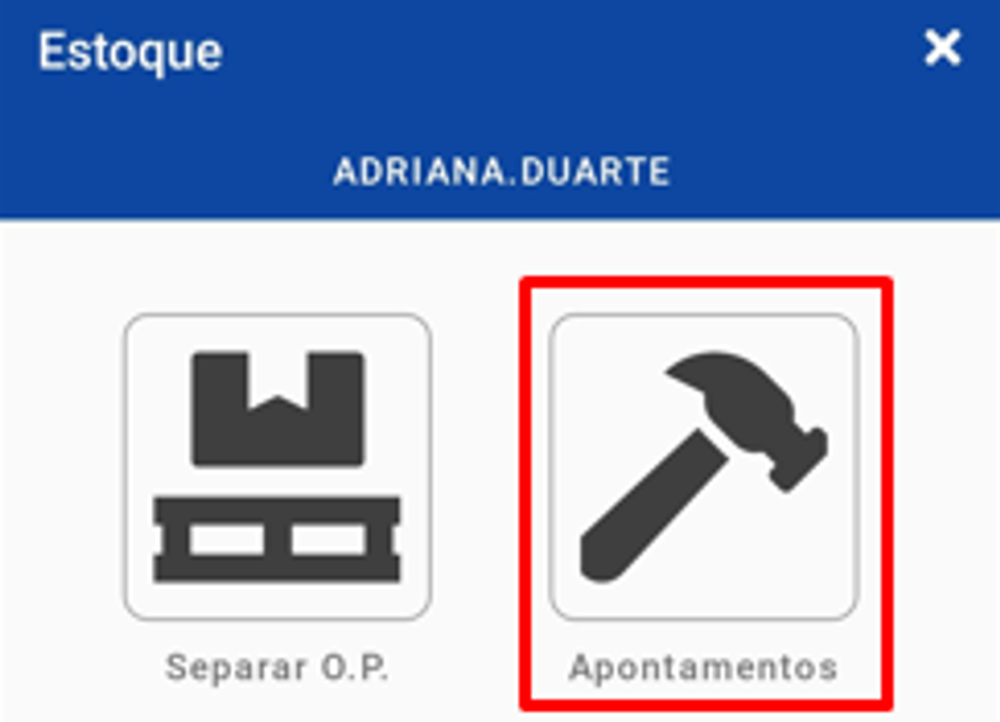
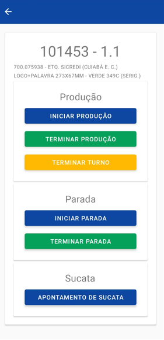
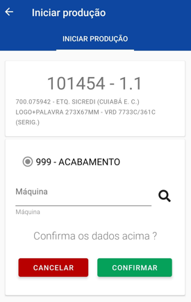
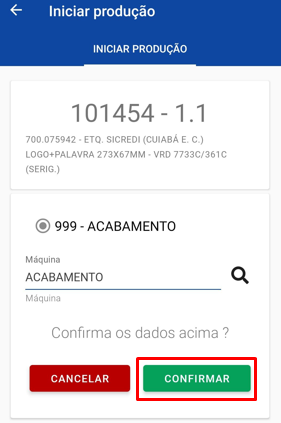
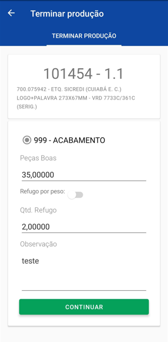
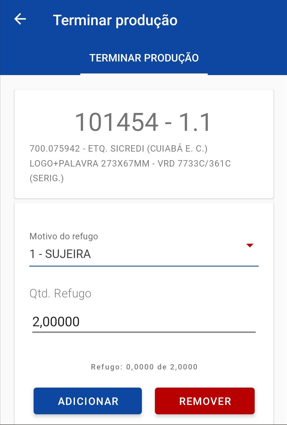
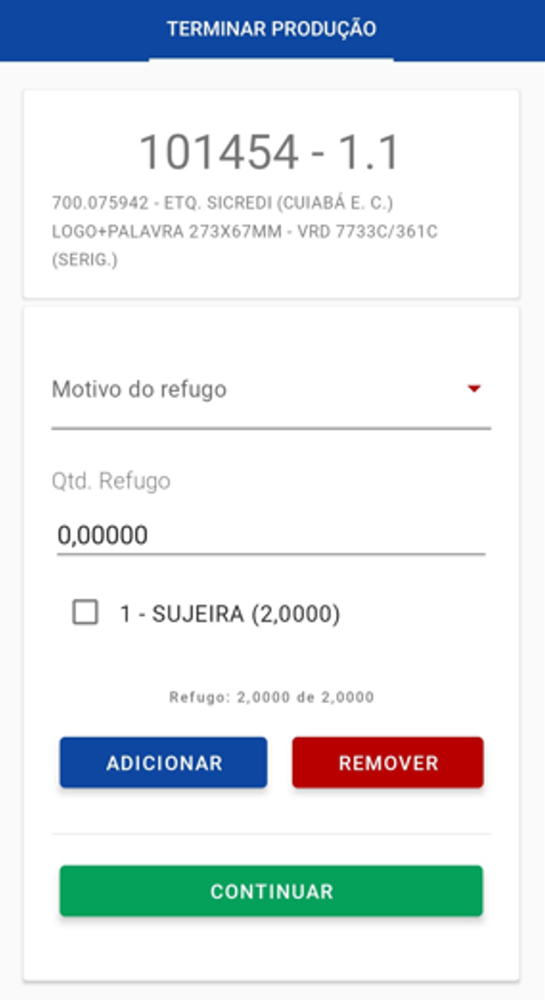
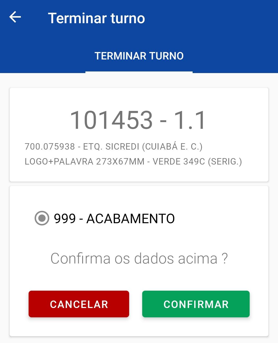
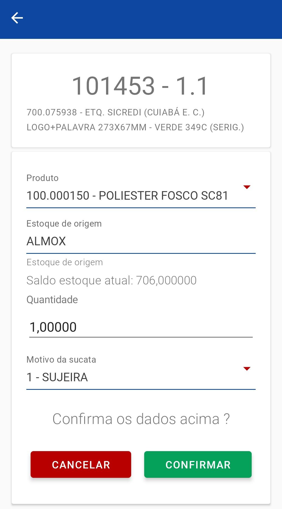

# Apontamentos

:::info
**Modulo**: Estoque Mobile

**Objetivo**: Capacitar o usuário para a instalação e  utilização do aplicativo Hino Estoque.

**Fluxo**: Download do aplicativo → Configuração do dispositivo → Instalação do Aplicativo → Configuração APP x ERP → **Utilização**
:::

:::danger
**Requisitos**: 

O aplicativo Hino Estoque deve estar instalado no dispositivo

O usuário deve ter acesso ao Hino ERP com permissões para o cadastro de colaboradores
:::

:::tip
Quer saber como instalar o aplicativo Hino Estoque? [**Clique aqui**](https://www.notion.so/Instala-o-do-aplicativo-Hino-Estoque-f3a7fe04e1074c80957ab9e6cf84044a?pvs=21)!
:::

:::tip
**Gatilho:** Quer saber como cadastrar um colaborador para uso do aplicativo? [Clique aqui](https://www.notion.so/Configura-o-APP-x-ERP-1-44a4008387dd4fa39a118bd1c47abd69?pvs=21)!
:::

---

Para acessar a tela de apontamentos aperte o botão de “APONTAMENTOS”

Você será levado para uma tela onde será mostrado as ordem de produção já apontadas pelo usuário logado no aplicativo.

Para realizar um novo apontamento você deve apertar o botão de “➕” no canto superior da tela o sistema entrará na tela de busca de O.P igual ao da separação de O.P (Dúvidas em como buscar a O.P? [clique aqui!](https://www.notion.so/Separar-O-P-37d5f1de10dd4828aa3b5964f11c74bf?pvs=21)) após selecionar a ordem você será enviado para a tela abaixo.

Nesta tela temos várias funções, entre elas estão:

**Iniciar produção:** para apontar o inicio de produção aperte o botão “Iniciar produção” e você será levado para a tela abaixo

Nessa tela basta selecionar o processo que deseja iniciar o apontamento e se necessário a máquina que será utilizada, para selecionar a máquina clique no botão “🔎” e será enviado a uma tela de seleção.

Nesta tela, selecione a máquina desejada e pressione "ok".

Com o processo e a máquina selecionada bastar apertar em “confirmar”.

**Terminar produção:** para apontar o termino da produção pressione o botão “Terminar produção” e você será levado a tela abaixo.

Selecione o processo que deseja apontar o término de produção, será necessário informar a quantidade de peças boas feitas e a quantidade de refugo se houver, temos a possibilidade de apontar o refugo por peso também.

Caso haja refugo o sistema irá abrir uma tela para informar os motivos de refugo.

Informe o motivo do refugo e a quantidade referente e pressione adicionar

Após todos os refugos serem adicionados pressione continuar.

**Terminar Turno:** Para apontar o término de turno basta pressionar “Terminar turno” e você será levado para a tela abaixo.

Selecione o processo e pressione confirmar.

**Apontamento de sucata:** para apontar sucata gerada pela ordem além do refugo podemos usar a tela de apontamento de sucata.

Nesta tela, será necessário informar o produto, o local do estoque de onde o produto será consumido, a quantidade a ser descartada e o motivo da geração do descarte, após preencher basta pressionar o botão “confirmar”.