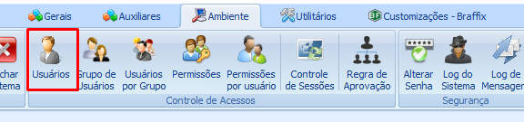

# Configuração APP x ERP

:::info
**Modulo**: Estoque Mobile

**Objetivo**: Capacitar o usuário para a instalação e  utilização do aplicativo Hino Estoque.

**Fluxo**: Download do aplicativo → Configuração do dispositivo → Instalação do Aplicativo → **Configuração APP x ERP** → Utilização
:::

:::danger
**Requisitos**: 

O aplicativo Hino Estoque deve estar instalado no dispositivo

O usuário deve ter acesso ao Hino ERP com permissões para o cadastro de colaboradores
:::

:::tip
Quer saber como instalar o aplicativo Hino Estoque? [**Clique aqui**](https://www.notion.so/Instala-o-do-aplicativo-Hino-Estoque-f3a7fe04e1074c80957ab9e6cf84044a?pvs=21)!
:::

---

## Sobre

Para que o colaborador consiga realizar o acesso no aplicativo Hino Estoque, é necessário fazer uma configuração no cadastro de colaborador no ERP. Para entender e realizar as configurações siga os passos abaixo.

## Configuração APP x ERP

1 - Acesse o Hino ERP

2 - Em Gerais clique em ‘Colaboradores’

3 - Localize o colaborador que vai ter acesso ao Aplicativo

:::warning
O colaborador que vai ter acesso ao aplicativo, deve possuir usuário cadastrado no ERP
:::

:::tip
Quer aprender a cadastrar usuários? [**Clique Aqui!**](https://www.notion.so/Cria-o-de-Usu-rios-para-o-ERP-5e14acced9604d91b8f8c69f85154cb5?pvs=21)
:::

4 - Clique sobre o colaborador desejado e clique em ‘Editar’.

5 - Ao editar o cadastro do colaborador realize as seguintes configurações

- Identificação: O campo identificação é para inserir o número do crachá do colaborador se o mesmo tiver e é com esse número que o colaborador irá realizar o login no aplicativo. Caso o colaborador não possua crachá, informa um número de sua preferência.

