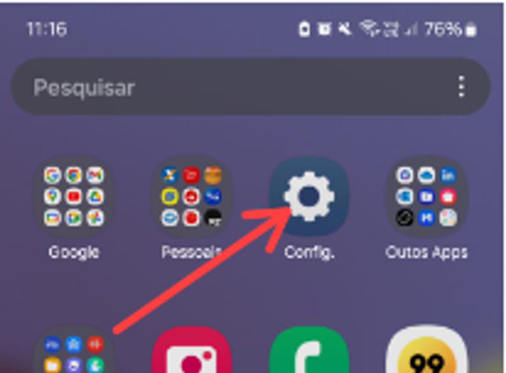
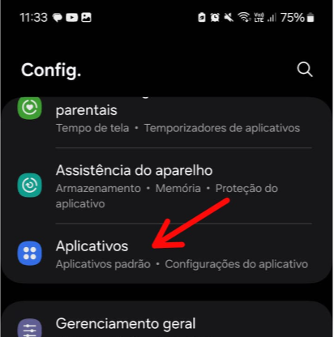
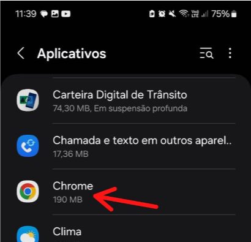
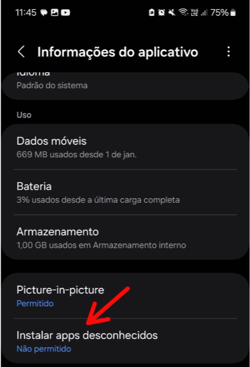
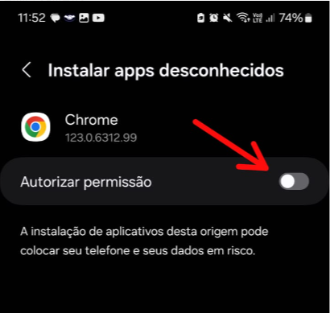
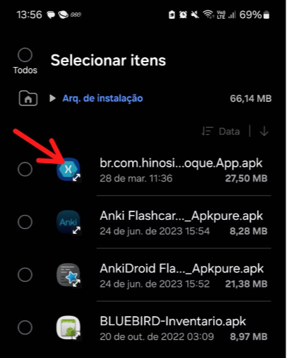
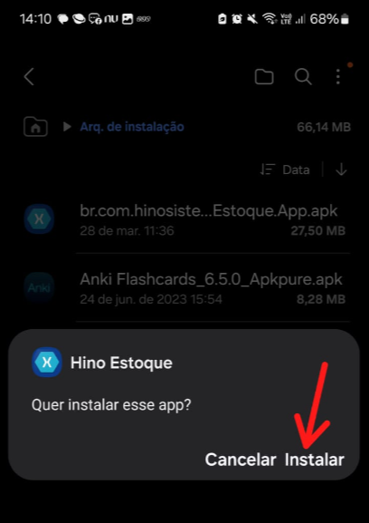
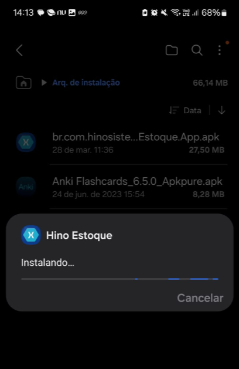
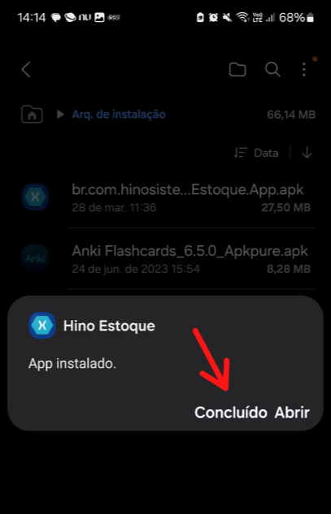
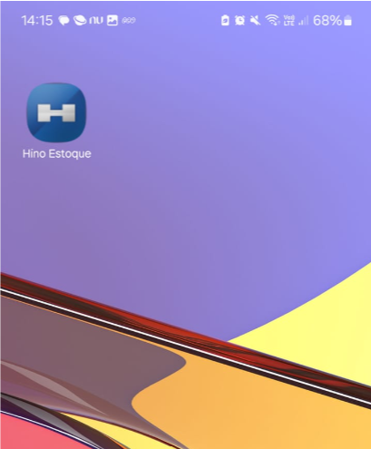

# Download e Instalação do Aplicativo

:::info
**Modulo**: Estoque Mobile

**Objetivo**: Capacitar o usuário para a instalação e  utilização do aplicativo Hino Estoque.

**Fluxo**: **Configuração do dispositivo** → Instalação do Aplicativo → Configuração APP x ERP → Utilização
:::

:::danger
**Requisitos**: 

Um dispositivo conectado a internet para realizar download do instalador.
Dispositivo com sistema Android versão 6.0 ou superior.
:::

:::tip
Para realizar o download do instalador [**Clique aqui!**](download-configuracao-app.md)
:::

___

O Hino estoque mobile é uma aplicação para sistemas android que possibilita que você manipule dados do ERP através de qualquer dispositivos que possuam sistema operacional Android. Para realizar a instalação do apk, habilite seu dispositivo para realizar instalação de aplicativos de fontes desconhecidas.

## Permissão para App’s de fontes desconhecidas

Como o aplicativo Hino Estoque não está disponível na Play Store, é necessário habilitar o dispositivo para realizar a intalação de apps de fontes desconhecidas. Não se preocupe! O aplicativo Hino Estoque é totalmente seguro. 

Se você estiver na versão Android 10 ou inferior siga o passo abaixo.

1 - Abra as configurações do aparelho

2 - Em configurações, abra a opção ‘Aplicativos’

3 - Procure pelo navegador de internet do dispositivo, em alguns pode ser o Google Chrome enquanto em outros pode ser o Samsung Internet.

4 - Procure pela opção ‘Instalar apps desconhecidos’ e clique sobre ela.

5 -  Caso a opção esteja desativadas, clique para ativar.

❗ Prontinho, o seu dispositivo já está preparado para receber o APK do Hino Estoque, caso seu dispositivo tenha a versão do Android superior a 10, em uma pesquisa rápida na internet você saberá como permitir a instalação de aplicativos  de fontes desconhecidos.

## Instalação do aplicativo Hino Estoque

Após realizar o download do instalador, localize em seu dispositivo o destino do arquivo. Após localizar siga os passos abaixo para realizar a instalação.

1 - Clique sobre o arquivo baixado para iniciar a instalação.

2 - Clique em Instalar para iniciar o instalador

3 - Aguarde a instalação ser concluída

4 - Clique em concluir

5 - O ícone do aplicativo será criado na área de trabalho.

A partir desse momento você já pode utilizar o aplicativo Hino Estoque para realizar apontamentos, transferências e mais.