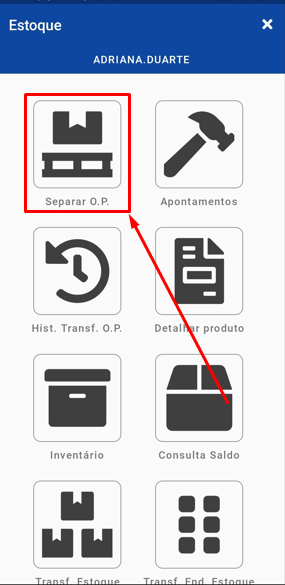
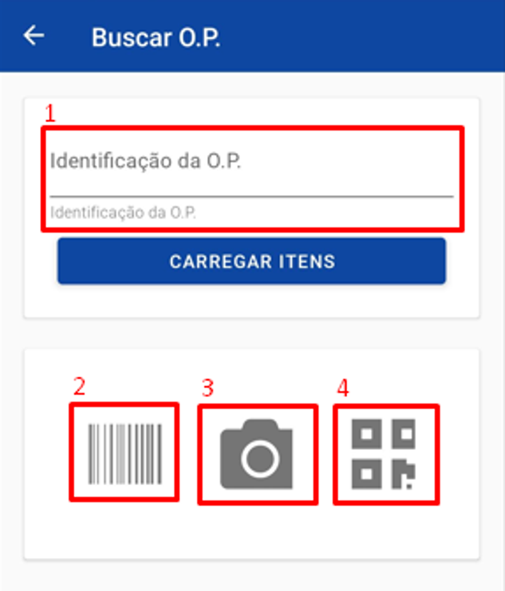
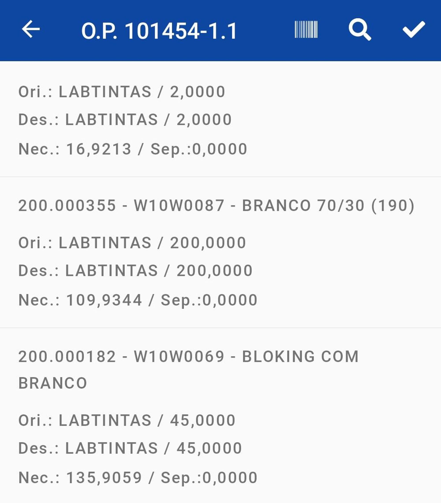
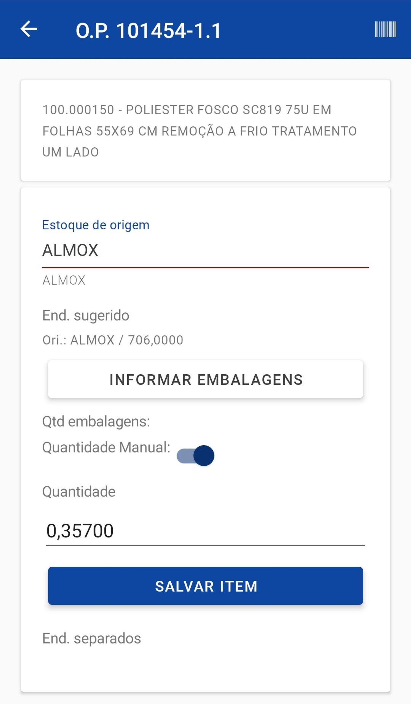
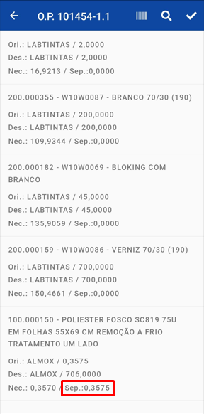
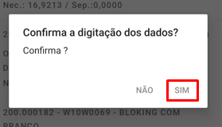
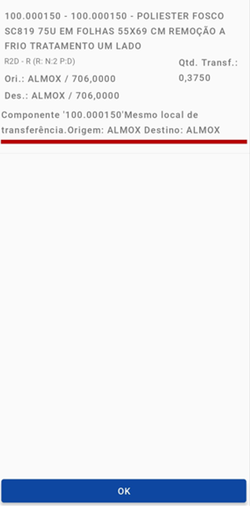

# Separar O.P

:::info
**Modulo**: Estoque Mobile

**Objetivo**: Capacitar o usuário para a instalação e  utilização do aplicativo Hino Estoque.

**Fluxo**: Download do aplicativo → Configuração do dispositivo → Instalação do Aplicativo → Configuração APP x ERP → **Utilização**
:::

:::danger
**Requisitos**: 

O aplicativo Hino Estoque deve estar instalado no dispositivo

O usuário deve ter acesso ao Hino ERP com permissões para o cadastro de colaboradores
:::

:::tip
Quer saber como instalar o aplicativo Hino Estoque? [**Clique aqui**](download-configuracao-app.md)!
:::

:::tip
Quer saber como cadastrar um colaborador para uso do aplicativo? [**Clique aqui**](configuracoes-previas.md)!
:::

---

## Sobre

No aplicativo temos a função de transferência de estoque para a ordem de produção, com essa função podemos transferir o saldo do estoque de origem do produto para o local de estoque de consumo da ordem.

**Acesso:** para usar basta abrir o aplicativo e clicar em separar O.P

**Tela de leitura:** Ao abrir será solicitado a leitura ou digitação do código de barras da ordem de produção, o aplicativo possui quatro formas diferentes de fazer a leitura da O.P.

**Método 1:** Digite o código de barras manualmente e, após a digitação, clique em carregar itens.

**Método 2:** Use um leitor de código de barras.

**Método 3:** Use a câmera do celular para ler o código de barras.

**Método 4:** Use a câmera do celular para ler o código QR.

**Escolha dos itens:** Após realizar a leitura da O.P será aberto uma tela que irá mostrar todos os itens para transferência.

Nesta tela você deve escolher o itens que deseja fazer a transferência, com isso será levado para a tela abaixo.

Nesta tela você deve informar o local de estoque de origem do produto (local de onde o produto deve ser retirado), após isso você deve habilitar o botão de quantidade manual e informar a quantidade e apertar o botão de salvar item.

Feita a separação será destacado na tela a quantidade separada, depois de separar todos os itens que deseja basta apertar o botão “✔”.

O sistema irá solicitar a confirmação dos dados digitados, se estiver tudo certo aperte o botão “SIM”.

O aplicativo trará um resumo dos itens que foram transferidos aperte em OK.

Com isso a transferência será concluída.

---