# Aplicativo Logistica

:::info
**Modulo**: App Logistica

**Objetivo**: Capacitar o usuário para a instalação e  utilização do aplicativo Hino Logistica.
:::

:::danger
**Requisitos**: 

1. Um dispositivo conectado a internet para realizar download do instalador.
2. Dispositivo com sistema Android versão 10.0 ou superior.
3. O aplicativo Hino Logistica deve estar instalado no dispositivo
:::

## Configurações

O Hino estoque mobile é uma aplicação para sistemas android que possibilita que você manipule dados do ERP através de qualquer dispositivos que possuam sistema operacional Android. Para realizar a instalação do apk, habilite seu dispositivo para realizar instalação de aplicativos de fontes desconhecidas.

### Permissão para App's de Fontes Desconhecidas

Como o aplicativo Hino Estoque não está disponível na Play Store, é necessário habilitar o dispositivo para realizar a intalação de apps de fontes desconhecidas. Não se preocupe! O aplicativo Hino Estoque é totalmente seguro. 

Se você estiver na versão Android 10 ou inferior siga o passo abaixo.

Abra as configurações do aparelho

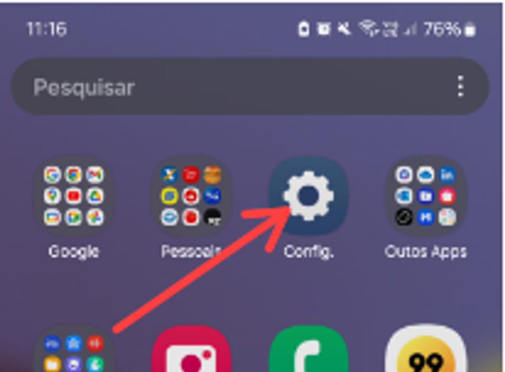

Em configurações, abra a opção ‘Aplicativos’

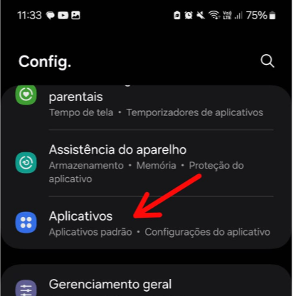

Procure pelo navegador de internet do dispositivo, em alguns pode ser o Google Chrome enquanto em outros pode ser o Samsung Internet.

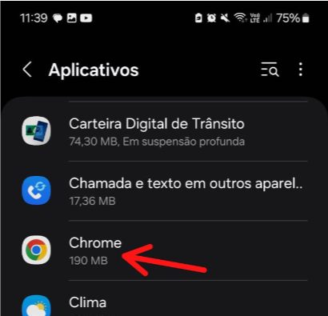

Procure pela opção ‘Instalar apps desconhecidos’ e clique sobre ela.

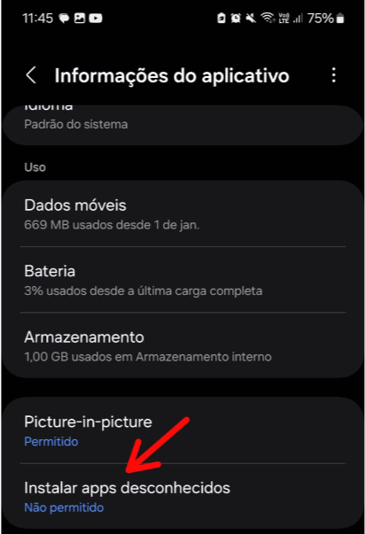

Caso a opção esteja desativadas, clique para ativar.

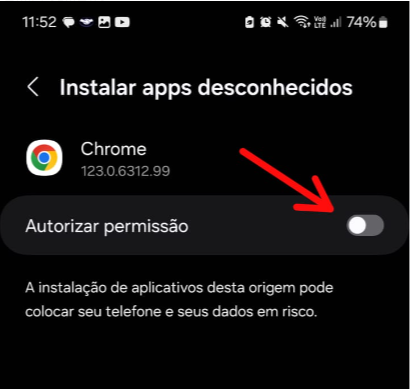

❗ Prontinho, o seu dispositivo já está preparado para receber o APK do Hino Estoque, caso seu dispositivo tenha a versão do Android superior a 10, em uma pesquisa rápida na internet você saberá como permitir a instalação de aplicativos  de fontes desconhecidos.

### Configurando o HinoERP.

É criado o Local de Estoque - O Local de estoque segue uma linha de endereçamento precisa criar um grupo de estoque PA e informar nos locais criados.

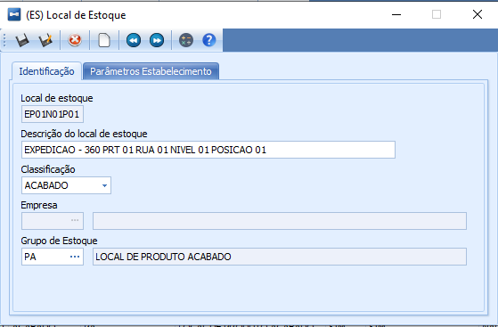

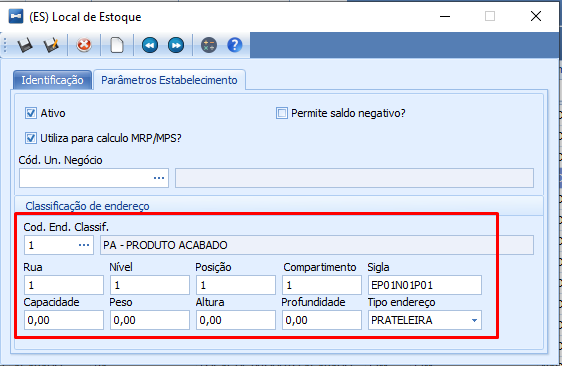

É criado os endereçamentos e dentro do Endereçamento é vinculado os Locais de Estoque criados anteriormente.
    
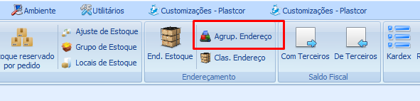

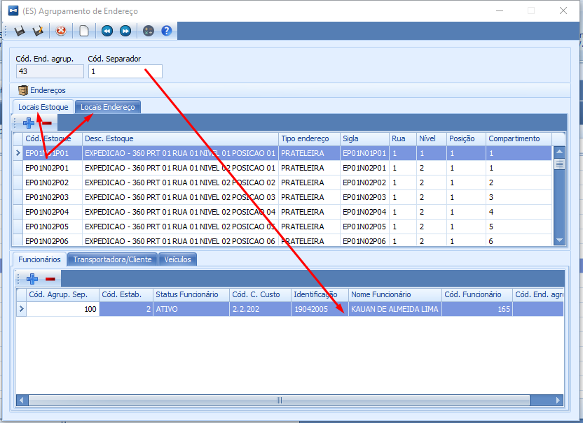
    
No agrupamento de endereço é vinculado o usuário. O usuário é associado a um Cod. Separador (criado manualmente) no agrupamento de estoque, na mesma tela é informado os endereços físicos de estoque. Conforme desmonstrado na imagem acima.

O saldo do produto é redirecionado ou alocado para um endereço físico.

Nos parâmetros de Romaneio é informado separação Mobile

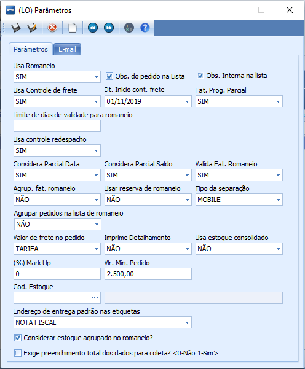

Crie também os Locais de Estoque abaixo

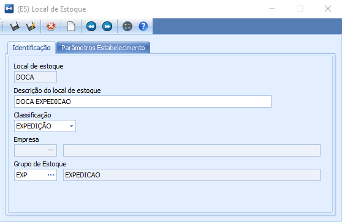

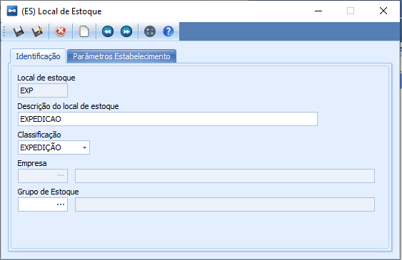

### Lógica de funcionamento

1. O pedido é inserido no sistema HinoERP;
2. É gerado o romaneio;
3. É gerada a Lista de Separação;
4. A Lista é liberada para separação;
5. Após isso a lista irá aparecer no aplicativo;
6. Ao usuário iniciar a separação, será possível selecionar a separação;
7. Após isso será apresentado os pedidos da lista;
8. Por fim selecionando o pedido será apresentado os itens do pedido;
9. Clicando-se sobre o item que será realizada a separação, será apresentado uma tela para se informar o endeço de onde está sendo retirado o produto e a respectiva quantidade, esse passo pode ser realizado mais de uma vez, para adicionar mais de uma separação em endereços distintos por exemplo.
10. Ao finalizar a separação do pedido, o mesmo será apresentado com a cor azul em seu código.
11. Por fim, clica-se em informar Doca, para informar o local de expedição onde o produto foi alocado.

PS: As leituras via aplicativo podem ser realizadas via Código de Barras, QRCode, ou digitação. 

---
