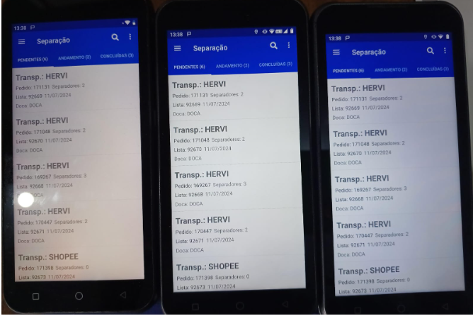
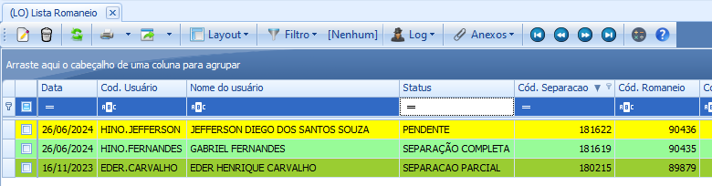
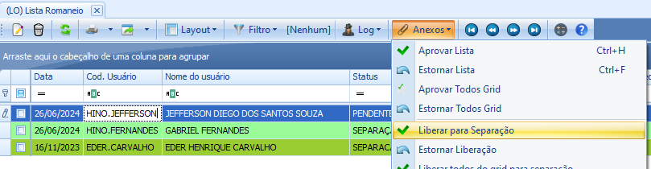
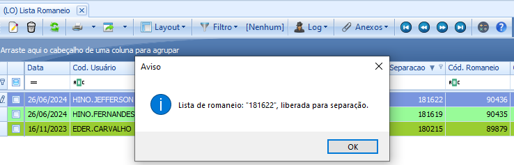
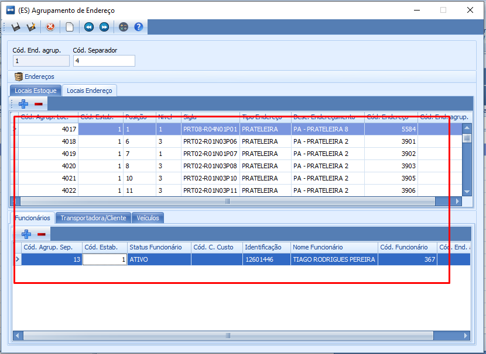

# Aplicativo Logística

### Configurações para  separação e exibição no aplicativo de Logística

1.  É criado o Local de Estoque - O Local de estoque segue uma linha de endereçamento precisa criar um grupo de estoque PA e informar nos locais criados.

1. É criado os endereçamentos e dentro do Edereçamento é vinculado os Locais de Estoque criados anteriormente.
    

    
1. No agrupamento de endereço é vinculado o usuário. O usuário é associado a um cod.separador (criado manualmente) no agrupamento de estoque, na mesma tela é informado os endereços físicos de estoque. Imagem acima.
2. O saldo do produto é redirecionado ou alocado para um endereço físico.
3. Nos parêmetros de Romaneio é informado separação Mobile

1. Crie também os Locais de Estoque abaixo

### Lógica de funcionamento

1. O pedido é inserido no sistema
2. É realizado o romaneio
3. É realizado a Lista
4. A lista é liberada para separação

### Tratativas no aplicativo Logística

Atualmente os Pedidos de uma lista liberada pelo ERP está aprarecendo para todos os usuários(cód. separador) QUE ESTÃO LOGADO no APP Logística. Os pedidos possui uma lógica de liberação onde deve ser apresentado o pedido apenas para os usuários(cód. separador) que o produto contém saldo no endereçamento onde o usuários(cód. separador) está vinculado.

**Saída resultado após uma lista ser liberada pra separação.**

**Esperado**

Ao liberar uma lista para separação o sistema deve realizar o seguinte filtro.

1.  **SE** usuários(cód. separador) logado no aplicativo = 1
2. Ao Liberar uma lista para separação

### Entradas

1. Clique em Romaneio
2. Selecione o Romaneio desejado clicando sobre ele
3. Clique em Anexos e em seguida Gerar Lista (Caso o romaneio já tenha uma Lista Gerada, clique em Lista)

### Saída Resultado

A tela **(LO)Lista Romaneio** será exibida, é nessa tela que contém todas as listas geradas com status *‘Pendente’, ‘Separação Completa’ e ‘Separação Parcial’. **Saída conforme esperado.***

### Entradas

1. Selecione uma lista de romaneio com status *‘Pendente’* clicando sobre ela
2. Clique em ‘*Anexos’* e em seguida clique em *‘Liberar para separação’*

### Saída Resultado

SE a operação foi realizada com sucesso, o sistema exibirá um aviso ‘*Lista de romaneio: xxx, liberada para separação.’ **Saída conforme esperado***

### Entradas

1. Clique em OK no aviso exibido

### Saída Resultado

1. O aviso é fechado e os pedidos da Lista aparecem no APP Logística para separação, porém os pedidos aparecem para todos os usuários logados no nomento.

### Saída Esperado

1. Ao Liberar uma lista para separação

**SE** saldo dos produtos do pedidos da ****Lista liberada **ESTÁ NO** endereço que **CONTÉM** usuários(cód. separador) = 1

**ENTÃO** **PRINT** o pedido no APP **ONDE** usuários(cód. separador) logado **= 1**

**QUANDO** usuário logado clicar no pedido

**ENTÃO PRINT** os produtos **ONDE** saldo > 0 **AND** Endereçamento **CONTÉM** usuários(cód. separador) = 1

---

### Tratativas no ERP

### Entrada

1. Selecione uma lista de romaneio com status *‘Pendente’* clicando sobre ela
2. Clique em ‘*Anexos’* e em seguida clique em *‘Liberar para separação’*

**SE** Endereçamento **ONDE** saldo produto >0 **AND** usuários(cód. separador) = ***null***

### Saída Resultado

**ENTÃO** **PRINT ‘*Não existe separador para:***  endereçamento …’

---

**SE** Endereçamento **ONDE** saldo produto >0 **AND** usuários(cód. separador) > 1 

### Saída Resultado

**ENTÃO** **PRINT** o pedido no APP **ONDE** usuários(cód. separador) logado **=** usuários(cód. separador) do endereçamento

**SE** usuário logado clicar no pedido

**ENTÃO PRINT** os produtos **ONDE** saldo > 0 **AND** Endereçamento **CONTÉM** usuários(cód. separador) **=** usuários(cód. separador) do endereçamento

---

Se um pedido tiver itens com saldo em endereçamento de multiplos separadores

Então apresente o pedido e os ítens de acordo com os separadores e seu grupo de endereçamento vinculado.

### Do processo de separação

1. Quando a lista de separação tem o pedido que contem o item que o saldo contempla o endereçamento onde existe apenas um usuário(separador) vinculado e o usuário(separador) realiza a separação o sistema se comporta como esperado.
2. Quando a lista de separação tem o pedido que contem o item que o saldo contempla o endereçamento de multiplos usuários(separadores) vinculados e um dos usuários (separador) completa a separação pertinente ao seu endereço, o sistema conclui o pedido para os demais separadores.

**Esperado**

Um pedido para separador A e separador B

Se separador ‘A’ concluir a separação dos itens que contempla o seu endereço, o pedido deve sumir da tela do separador ‘A’ mas continuar na tela do separador ‘B’ até que o mesmo conclua a separação.

1. Se um produto estiver com saldos em multiplos endereçamento, apresentar para o separador do endereço com o saldo do produto no nível mais baixo.

---
