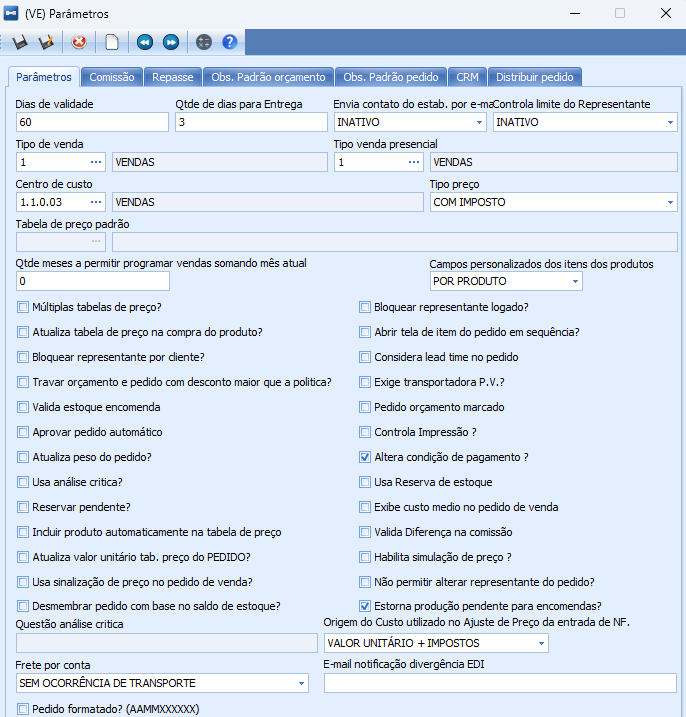

# Configurações

O sistema utiliza-se da API v2 do Pieta para realização das integrações. Mas para que isso ocorra é necessário que haja algumas configurações pré-existentes seja no Hino ou no Pieta. 


## Pieta

No Pieta será necessário configurar:

Os status que serão utilizados;


Configurar os Responsáveis por cada Integrador


Deverá estar devidamente configurado também as informações de pagamento, onde as descrições das formas de pagamento e das condições devem estar iguais às que estiverem cadastradas no sistema, para que seja possível realizar a localização das informações: 


## Hino ERP

No Hino será necessário realizar as seguintes configurações:

Parâmetros de Integração - Disposto em Integração > Configuração do Peido. 


Configuração de Integração dos Códigos dos Produto - Nessa tela será informado o produto do Hino, o código correspondente do produto no Pieta e a Origem, neste caso “Pieta”.


Os responsáveis (vendedores internos que gerenciam os integradores) - Estes deverão ter a empresa do tipo Representante vinculado ao seu usuário e o e-mail do usuário devidamente preenchido, sendo esse o mesmo e-mail utilizado no Pieta.

Os integradores deverão estar com o CNPJ devidamente preenchido no endereço do tipo Comercial no Hino ERP e com a empresa do tipo Fornecedor.

## Serviço Integração

No serviço de integração, o arquivo appsetings.json, deverão constar as informações de API Key do Pieta, a connectionString, datasource e usuário e senha, além de um MaxRange (para alterar qual produto será vendido de acordo com o KW do Kit), o produto para caso o KW do Kit esteja abaixo, e outro para caso esteja acima. TimeDelay é o tempo em minutos para cada ciclo de integração. E caso o estabelecimento seja diferente do Estabelecimento 1, deve-se informar o número do estabelecimento no qual será integrado.

```json
{
  "Logging": {
    "LogLevel": {
      "Default": "Information",
      "Microsoft": "Information",
      "Microsoft.Hosting.Lifetime": "Information",
      "Microsoft.EntityFrameworkCore": "Warning"
    }
  },
  "AllowedHosts": "*",
  "ConnectionStrings": {
    "DefaultConnection": "CONNECTION_STRING"
  },
  "Pieta" : {
    "ServiceApiKey": "API_KEY",
    "connectionString": "CONNECTION_STRING",
    "DataSource" : "DATASOURCE",
    "UserID" : "USER_ID",
    "Password" : "PASSWORD",
    "MaxRange" : "75",
    "ProductUnderRange" : "CODPRODUTO_HINO_1", 
    "ProductOverRange" : "CODPRODUTO_HINO_2",
    "TimeDelay": "1"
  },
  "CODESTAB": 4 
}
```

## Outros

Para o caso se ser gerado o pedido de compra para o pagamento dos integradores, deve-se configurar nos parâmetros do módulo de venda os seguintes dados:


Para que as Ordens de Produção geradas pelo pedido sejam estornadas ao estornar o pedido de venda, caso não hajam lançamentos deve-se marcar o respectivo parâmetro (Estorna Produção pendente para encomendas):



Para que a O.P. seja gerada, deverá ser gerado uma estrutura para os produtos indicados no Json de configuração do serviço de integração. Essa estrutura não deverá conter componentes, vistos que estes serão carregados pelos componentes do Kit, que são salvos na integração.

Para que o funcionamento também é necessário haver os cadastros dos parâmetros de Vendas, Logística e os Locais de Estoque de Inspeção. 

PS: No código e nas packages há uma tratativa específica para o CNPJ da Megacomm.