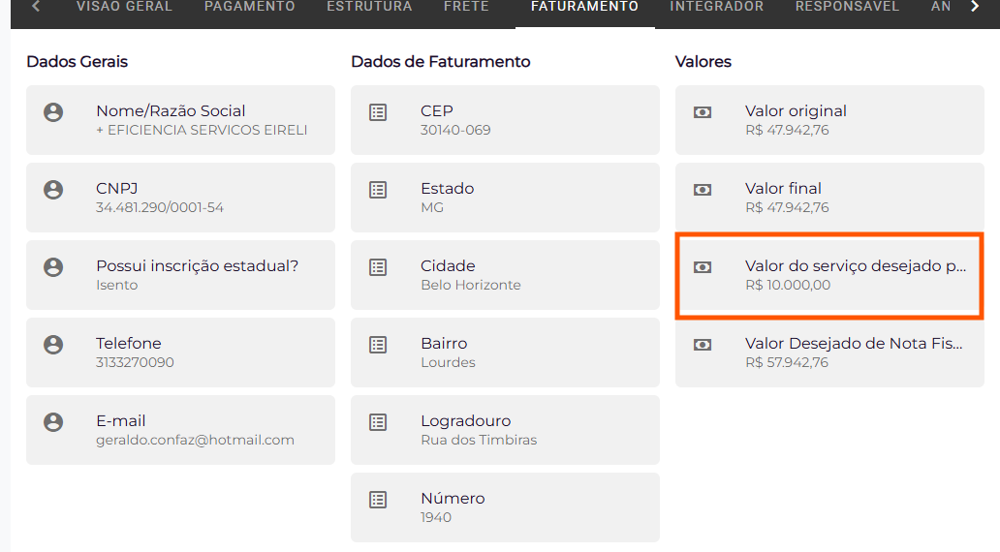

# Utilização

A utilização da integração é realizada da seguinte maneira:

- O integrador deverá gerar o orçamento no Pieta.
    - Caso haja, o valor do repasse (pagamento ao integrador), o mesmo deverá informar como “Valor do Serviço desejado”, esse será o valor que será adicionado como valor de repasse.
    
    
    
- O Responsável irá aprovar o orçamento, gerando o pedido.
- O serviço de integração do Hino a cada 5 minutos irá verificar os pedidos adicionados e inclui-los no sistema.
- O sistema irá então criar um pedido de venda para o produto final (Kit), de acordo com o KW especificado pelo limite e o presente no Kit.
- Após isso ao usuário aprovar o pedido de venda, o sistema irá gerar o programa e a ordem de produção, com os componentes carregados do Pieta.
- Ao aprovar o pedido de venda, o sistema irá gerar um pedido de compra para o integrador e com o valor de repasse para o produto parametrizado.
- O apontamento da OP irá gerar o saldo para o produto final e o consumo dos componentes do estoque. E o processo padrão do sistema poderá seguir normalmente.