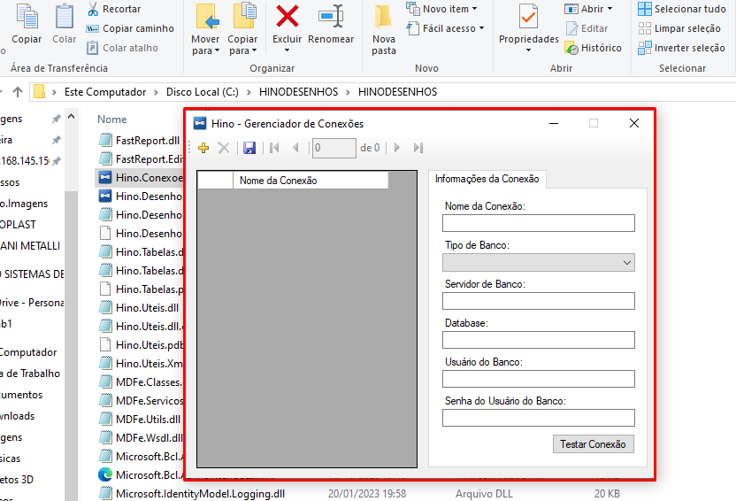
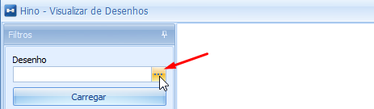

# Hino Desenhos

:::info
**Modulo**: Hino Desenho

**Objetivo**: Permitir a visualização de desenhos da engenharia através do ‘Hino Desenhos’
:::

:::danger
**Requisitos**: 

1. A pasta no servidor onde os desenhos estão hospedadas devem estar com acesso a leitura habilitado.
2. Os desenhos devem estar devidamente renomeados e registrados em ‘EN Desenhos’
3. A conexão do módulo ‘Hino Desenhos’ deve estar configuradas
:::

---

Obtenha o pacote de instalação do ‘Hino Desenhos’ **[clicando aqui](https://drive.google.com/drive/folders/12qNVCFm2QnXvQPDJbxX8yqSim2mGA13E?usp=sharing)** e realizando o downaload. Após realizar o download do arquivo siga as instruções abaixo.

## Instruções para ‘Hino Desenhos’

### Instalação na estação de visualização dos desenhos.

Escolha qual computador vai ficar a disposição para executar o ‘Hino Desenhos’, as instruções pode ser replicadas para mais de uma máquina se necessário.

- Localize o arquivo baixado

- Recorte o arquivo e mova para o Disco Local (C:)

- Extraia o arquivo em uma pasta no mesmo local

- Dentro da pasta criada ‘HINODESENHOS’, localize o arquivo de aplicação chamado ‘**Hino.Desenho.exe**’

…e envie um atalho do ícone para a área de trabalho do computador.

Para executar o aplicativo, basta o usuário dar dois cliques no ícone enviado para área de trabalho. Não é necessário realizar nenhum tipo de login.

---

### Configuração da conexão em ‘Hino Desenhos’.

A conexão permite que o aplicativo ‘Hino Desenhos’ realize a leitura e a visualização dos desenhos no aplicativo, sem a conexão não é possível o aplicativo encherga os desenhos da engenharia. Para realizar a conexão solicite os dados de conexão do ERP ao suporte ou se já tiver em posse dos dados siga as instruções abaixo.

- Dentro da pasta local do ‘HINODESENHOS’ localize o arquivo ‘**Hino.Conexões.exe**’

- Execute o aplicativo com dois cliques, ao executar será aberto o **Gerênciador de Conexões**

- Clique no sinal de ‘**+**’ para iniciar a inclusão de uma nova conexão.

A conexão deve ser a mesma do ERP para que o aplicativo consiga visualizar as Estruturas e os Desenhos cadastrados no aplicativo. Porém o nome da conexão de ser ‘**DESENHO**’ 

- Preencha o nome ‘**Conexão**’
- Preencha o ‘**Servidor de Banco**’
- Preencha o ‘**Usuário do Banco**’
- Preencha a ‘**Senha do Usuário do Banco**’

- Clique em  ‘**Testar Conexão**’, se os dados estiverem corretos a conexão será bem sucedida.

- Clique em salvar e fechar o Gerênciador.

Agora com a conexão estabelecida o aplicativo ‘**Hino Desenhos**’ já consegue olhar para os dados dentro do ERP.

---

### Configurando o ERP para apontar os dados de Desenhos para o aplicativo.

Algumas parâmetrizações no ERP são necessárias para que o aplicativo ‘**Hino Desenhos**’ possa apresentar os dados .

- Nos parâmetros de ‘(EN)ENGENHARIA’ defina o caminho da pasta onde são guardados os desenhos, é preciso que a pasta esteja em um servidor online e que o computador que vai executar o aplicativo ‘**Hino Desenhos**’ tenha a permissão de acesso na rede.

- No módulo de Engenharia, acesse ‘Desenhos’

- Clique em novo e realize o cadastro do desenho, preencha os dados e clique em Salvar

- Na aba ‘Revisão’ clique em novo e cadasstre a revisão do desenho. Após realizado o preenchimento dos dados necessários salve o desenho.

- Na pasta onde estão os desenhos, verifique se o nome do arquivo é o mesmo do código do desenho cadastrado no ERP

---

### Abrindo o desenho de engenharia no aplicativo Hino Desenho
- Execute o aplicativo ‘**Hino Desenhos**’ clicando duas veses no ícone que pode estar na área de trabalho ou no local definido no início desse tutorial.

- Ao executar o aplicativo irá abrir. Esse aplicativo não pede senha e nem usuário pois se conectar direto ao ERP se a conexão estiver estabelecida.
- 

- Clique nos ‘…’ para listar os produtos e verificar os que possuem algum desenho vinculado

Os produtos serão exibidos…..

- Clique no produto desejado e depois clique em ‘**Carregar**’. Ao clicar em carregar, a árvore de produtos será expandida.

Atente-se a legenda que possibilita identificar se um determinado produto tem ou não desenho vinculado . 

- Selecione o produto que tem desenho, e clique em ‘**Abrir desenho**’

Ao clicar em ‘Abrir desenho’ se o caminho para pasta estiver correto e as permissões de acesso pela estação aos arquivos estiverem configurados o desenho será carregado e exibido.

Através do Hino desenhos é possível apenas explorar o documento, não é possível editar, excluir ou alterar os arquivos na pasta de destino.