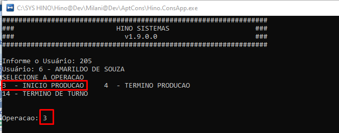

# Terminal de apontamento de produção

:::info
**Modulo**: Produção

**Objetivo**: Realizar o apontamento de produção através do terminal
:::

:::danger
**Requisitos**

1. O colaborador deve estar cadastrado com o número de identificação.
2. O usuário de apontamento genérico ou usuário/colaborador deve estar cadastrado.
3. Os motivos devem estar cadastrados
:::
___

## Configurações de parâmetros do estabelecimento

Nos parâmetros de produção na aba “Terminal”, devem estar configurado os motivos padrão para uso no terminal, e qual o tipo de apontamento↓

Para cadastrar os motivos: Menu → Produção → Motivos ↓

## Configurações de usuários

1 - O colaborador deve estar cadastrado e deve ter um número de identificação. ↓

Para cadastrar os colaboradores: Gerais → Colaboradores ↓

2 - Deve haver um cadastro de Usuário genérico para produção

Para cadastrar usuários: Ambiente → Usuários↓

3 - O usuário genérico de produção deve estar vinculado a todos os colaboradores que irão realizar apontamento de produção. Para isso precisamos editar o cadastro do colaborador e no campo Usuário, vincular o usuário genérico criado para produção ↓

4 -  Ainda no cadastro do colaborador na aba “Terminal | Mobile”, precisamos informar quais os apontamentos que esse colaborador pode realizar no terminal↓

Essas informações podem ser diferentes por colaborador.

## Iniciando o Terminal

Ao iniciar o terminal de apontamento essa é a tela que será exibida↓

## Informando o usuário

Para informar o usuário, o colaborador deve informar o seu número de identificação(crachá) que está informado no campo identificação no cadastro de colaborador e clicar em ENTER↓

## Selecionando a Operação

Em seguida, o usuário deverá informar o número da operação que irá apontar de acordo com os disponíveis no terminal. Se for início de produção ‘3’ e assim por diante.

## Informando a Ordem de Produção

Após informar a operação e clicar em ENTER, o terminal vai pedir qual é a Ordem de Produção (OP)

Na tela de Ordens de Produção do HINO ERP, tem o campo Cód. Barras

Esse número do Cód.Barras é informado no terminal

Após informar o número Clique em ENTER

Após clicar em ENTER o terminal vai exibir novos dados que podem ser compreendidos na imagem abaixo↓

Confirma o início de produção?

O colaborador deve clicar 1 para SIM ou 0 para NÃO

1 para SIM ou 0 para NÃO + ENTER

O terminal, vai apresentar a mensagem (Aguarde…, Salvo com sucesso)

A produção foi iniciada. Basta clicar em ENTER novamente para voltar à tela inicial.↓

## Acompanhamento de Ordens de Produção

As ordens de produção que estão em andamento podem ser acompanhadas pelo HINO ERP. Para acompanhar acesse: Menu → Produção → Terminal → Apontamento Terminal↓

Observe que você verá a ordem de Produção iniciada

## Apontamento de Término de Produção

Após concluir a Ordem de Produção, o colaborador deve apontar o término da produção. O processo é o mesmo do início porém agora ao invés de ser apontado código 3 - INÍCIO DE PRODUÇÃO, vai ser apontado código 4 - TÉRMINO DE PRODUÇÃO.

Em sequência será necessário informar peças boas, refugos, retrabalho etc… Confira o Slide abaixo↓

Após realizar o apontamento, na tela de acompanhamento a ordem de produção é atualizada para FINALIZADO↓

